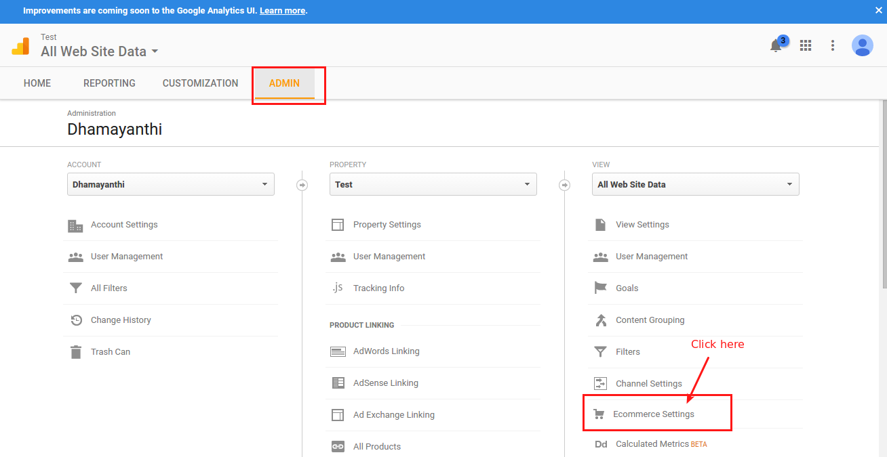
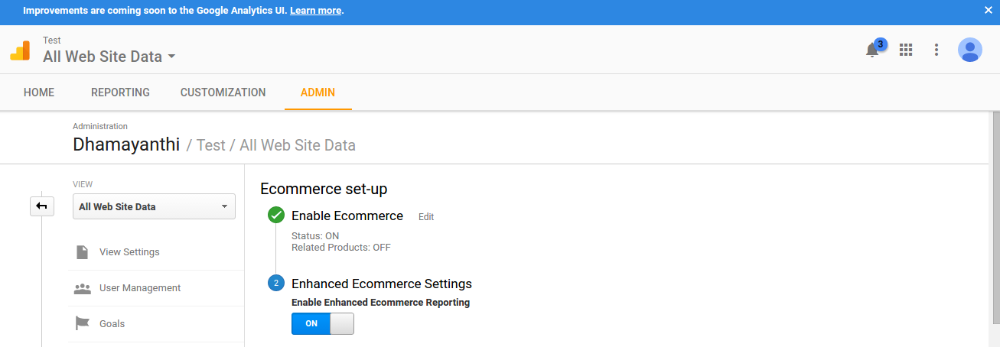
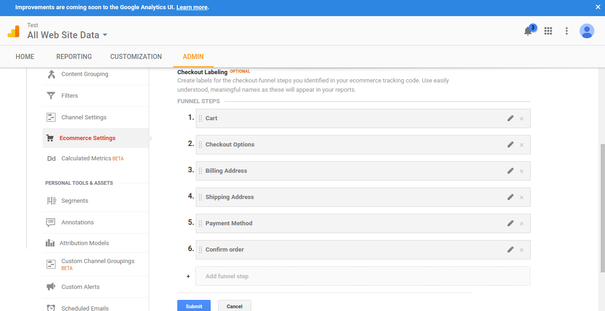

# E-commerce Google Analytics

This app allows you to use Google Analytics – Enhanced Ecommerce feature. You can track the user behavior across your e-commerce store starting from product views to thank you page.

## Requirements

1. PHP version 5.4 or higher
2. Joomla version 3.x or higher
3. J2Store version 3.2.10 or above

### Installation

1. Download E-commerce Google Analytics app from our site's extensions section and install it using Joomla installer.
2. After installing the app, go to J2Store > Apps and click Enable on E-commerce Google Analytics to activate the app.
3. Once enabled, click on Open to configure the basic settings of the app.

### How to get Google Analytics ID ?

**Step 1 :**

Login into your google account and go to Google analytics (<https://analytics.google.com/>).

**Step 2 :**

If you have not already sign up, click Sign up button on right side of the page.

**Step 3 :**

Enter your Account Name, Website Name, Website URL and choose industry category and reporting time zone.

Finally click Get Tracking ID.

Copy your Tracking ID and paste it in our app settings.

### App Configuration

#### Enhanced Ecommerce Google Analytics

**Google Analytics ID :**

Enter your Google Analytics ID here. You can login into your Google Analytics account to find your ID.

**Set Domain Name :**

**Tracking code :**

This feature adds Universal Analytics Tracking Code to your Store. You don't need to enable this if using a 3rd party analytics plugin.

**Impression Threshold :**

This feature sets Impression threshold for category page. It sends hit after these many numbers of products impressions.

### Behavior Analysis in Google Analytics

1. After login into Google Analytics, move to **ADMIN** tab and navigate to the Ecommerce Settings menu. 
2. In the E-commerce setup page, you have to **turn on** the Enable E-commerce.

3. Then, **Turn on** the Enable Enhanced Ecommerce Reporting. 

4. After that, it is mandatory to create following checkout lables:

  a. Cart

  b. Checkout Options

  c. Billing Address

  d. Shipping Address

  e. Payment method

  f. Confirm order 

5. Once finished configuring our E-commerce Google Analytics app and enabling enhanced eCommerce reporting in your Google Analytics account, go to your site frontend and place the order.

6. Now go to your Google Analytics page > move to **Reporting** tab

7. In the reporting page, click Conversions > Ecommerce > Shopping Analysis > Shopping Behavior in the left panel to see the behavior analysis of your eCommerce store. 

8. Click Conversions > Ecommerce > Shopping Analysis > Checkout Behavior to see the behavior analysis of checkout process.

#### Google Calender

Our E-commerce Google Analytics app comes with Google calendar Integration.

To use this integration you need to create a project in Google Developers Console. Once your project has been created, you must enable the Google Calendar API in Your Project > Library, finally in Your Project > Credentials > Create Credentials you must create an OAuth Client ID for a Web application and set the Authorized redirect URIs.

**Client ID :** Enter your Google client ID

**Client Secret :** Enter your Google client secret key.

**Calendar ID :** Enter your google calendar ID here.

**Debug Log :**

### Creating a Google API Console project and client ID

To create a Google API Console project and client ID, follow these steps:

1. Go to the Google API Console .
2. From the project drop-down, select an existing project , or create a new one by selecting Create a new project.

  > Note: Use a single project to hold all platform instances of your app (Android, iOS, web, etc.), each with a different Client ID.

3. In the sidebar under "API Manager", select Credentials, then select the OAuth consent screen tab.

  a. Choose an Email Address, specify a Product Name, and press Save.

4. In the Credentials tab, select the New credentials drop-down list, and choose OAuth client ID.

5. Under Application type, select Web application. Register the origins from which your app is allowed to access the Google APIs, as follows. An origin is a unique combination of protocol, hostname, and port.

  a. In the Authorized JavaScript origins field, enter the origin for your app. You can enter multiple origins to allow for your app to run on different protocols, domains, or subdomains. You cannot use wildcards. In the example below, the second URL could be a production URL.

  <http://localhost:8080> <https://myproductionurl.example.com>

  b. The Authorized redirect URI field does not require a value. Redirect URIs are not used with JavaScript APIs.

  c. Press the Create button.

6. From the resulting OAuth client dialog box, copy the Client ID . The Client ID lets your app access enabled Google APIs.

### Finding Your Google Calendar ID

1. Open your Google Calendar app page using your Google account.
2. Navigate to your subscribed/available Google calendars list (usually bottom left side).
3. A new page will open. Find the Calendar ID at the bottom as shown in picture and paste it in the corresponding field in the Calendar Settings.

  > Note: Double check you have pasted the right text string and make sure there are no extra spaces.
