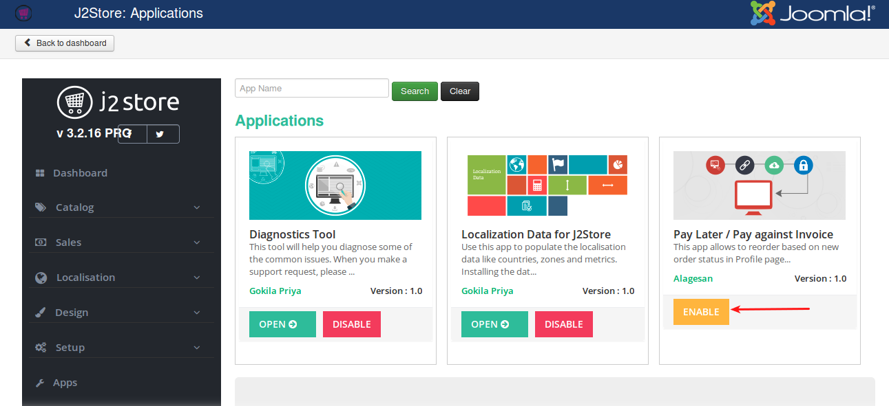
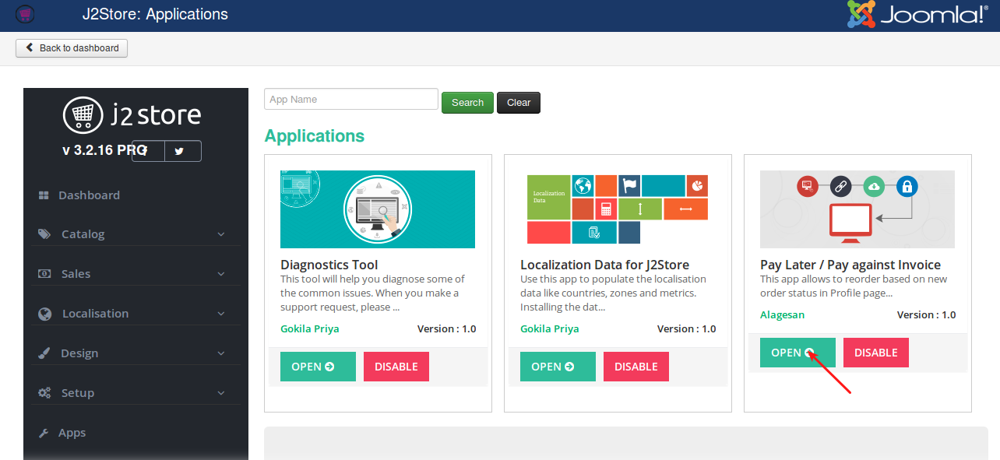
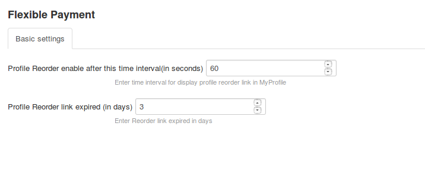
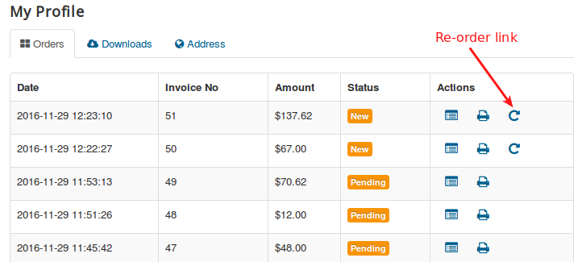
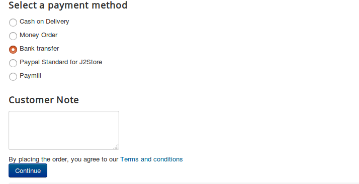
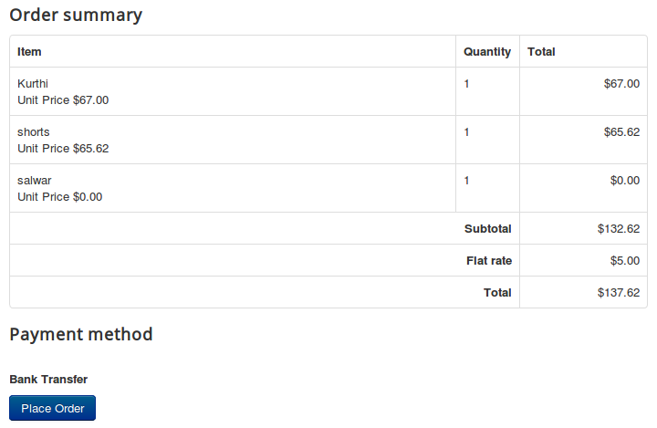

# Pay Later / Pay against Invoice

Invoice your customers and allow them to pay for the order online at a later date. There can be a number of situations when you want to send the invoice to the customer, complete the terms and then collect payments.

1. Invoice first, collect payment online
2. Allow customers to re-try payment for unpaid orders

## Requirements

1. Joomla 3.x
2. J2Store 3.2.14 or higher
3. PHP version 5.4 or higher

### Installation

1. Download Pay later app from our site and install it using Joomla installer.
2. After the installating, go to J2Store > Apps and find Pay Later / Pay against Invoice app.
3. Click Enable to activate Pay Later / Pay against Invoice app. 

4. Click Open to get started with app. 

#### Basic settings

It is very simple and easier to get started with this app. There is no complex settings needs to be configured. You just enter the time interval between which the re-order link should be appeared/disappeared.

**Profile Reorder enable after this time interval(in seconds) :** Enter the time (in seconds) at which the re-order link should appear on customer's order history page. For example, 60 seconds. Re-order link will appear after 60 seconds from the time when customer abandoned the order.

**Profile Reorder link expired (in days) :** Define when the re-order link should disappear from customer's order history page. For example, 5\. Re-order link will get expired after 5 days.

#### Use cases

This app can be possible at below two use cases.

**Use Case 1:** Invoice first, collect payment online

In the traditional methods, you would have to ask customers to manually transfer the money to your bank. You can now automate this process.

Just create an order in the backend, send the invoice to the customer and when he is ready, he can just view the order and make the payment online. No hassles in collecting payments.

For example, consider you are designing and selling gift cards. You can get quote and gift card details from customer. Once you finished designing gift card and it is ready to sell him, just create an unpaid order from store backend and send the invoice. So customer can view the order and make the payment online.

**Use Case 2 :** Allow customers to re-try payment for unpaid orders

Sometimes, customers abandon the order and leave your site without making payment. You can now easily close those abandoned orders by allowing customers to re-try the payment from their order history page.

#### Frontend screenshots

**Re-order link appears**

**After clicking on Re-order link,**

**Order summary**

