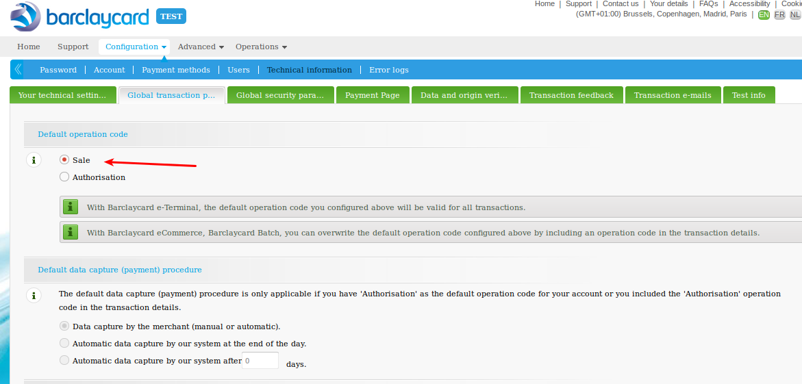
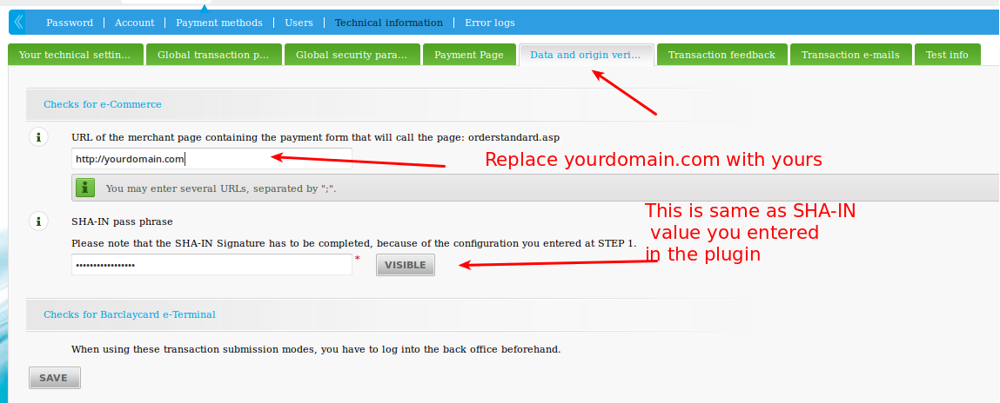
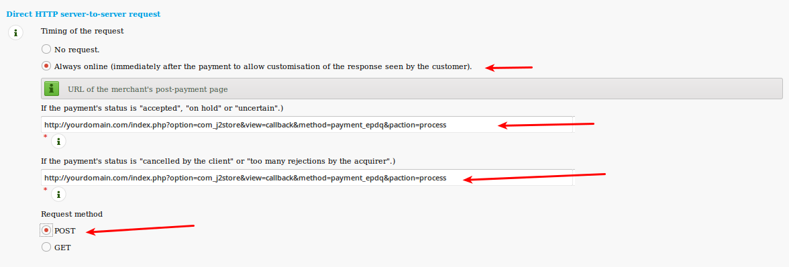
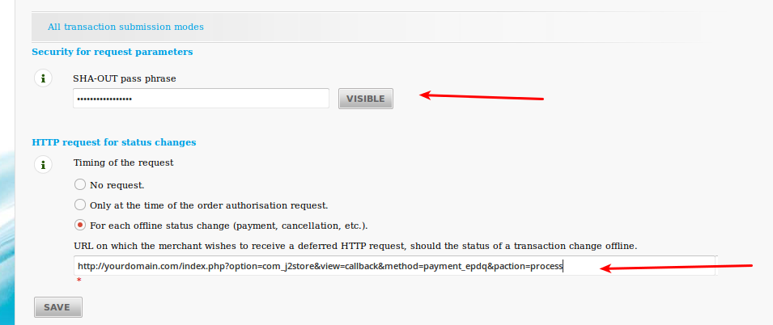

# Barclays ePDQ Payment Plugin

This plugin integrates the Barclays ePDQ payment gateway with the J2Store shopping cart.

#### Requirements
* PHP 5.3 or higher
* Joomla 2.5.x/3.0x
* J2Store 2.7.3 + (Note the plugin will not work with earlier versions of J2Store)

#### Required ePDQ settings
Login to your ePDQ Barclayscard merchant account.
Go to Confgurations → Technical Information

#### Global Transaction Parameters
##### Default operation code

You have two default operation code, **Sale** and **Authorization**. The brief description of both is given below.

**Sale**

This will enable you to receive instant payment

**Authorization**

You have to capture this either manually or automatically.

For Sale, a successful payment will return Status code 9 and for a Successful Authorisation, the status code is 5. Both the cases will be treated as Success and Confrmed by the **ePDQ** plugin.

>NOTE: If you are selling digital goods, it is advised to use SALE as operation code

Check the image below for a clear understanding.

The following parameters for technical information in your **ePDQ** account should be set as instructed below.

##### Hashing method (Tab: Security)
This should be set to SHA-1, as the plugin will not function with other methods. Check the image on how to do this.

##### Checks for E-Commerce (Tab: Data and origin verifcation)
URL of the merchant page containing the payment form that will call the page: orderstandard.asp - This should be set to http://www.yourdomain.com

Also enter a SHA-IN pass pharse here. The same should be entered in the plugin as well.

##### Post sale confguration : (Tab: Transaction feedback)
This is required to update our database after the payment is done.

Under the heading “Direct HTTP server-to-server request”, set both the URLs of the merchant's post-payment page as below:
http://yourdomain.com/index.php?option=com_j2store&view=callback&method=payment_epdq&paction=process

##### Request method: POST
**(see the picture below with example urls)**

#### Installation Instructions

1. Use the Joomla installer to install the plugin.
2. In the backend, go to J2Store → Set up → Payment → ePDQ Barclays → Edit Parameters
3. Enable the plugin4. Enter the parameters (read the explanation about each parameter given below)
5. Save and close it.

#### Parameters
**ePDQ Account PSPID**

This is your Unique Merchant ID provided by the Barclays ePDQ

**SHA1-IN Signature**

This is the SHA-1 IN signature set up by you in the **ePDQ** settings (see below for the required settings to be done at your **ePDQ** account). This ensure security of your transaction.

**SHA1-OUT Signature**
This is the SHA-1 OUT signature set up by you in the **ePDQ** settings. (see below for the required settings to be done at your **ePDQ** account)

**Title Header of Payment Page**

Optional setting. Enter a text that will be displayed as the title of the payment page.

**Custom Logo**

Optional setting. Enter a url (https) pointing to your logo image.
>NOTE: DO NOT enter an unsecure url (one that starts with http://) here. It will result in an error

**Custom Background Colour**

Enter a hex colour code here to change the background colour of the payment page. *Example: #ff0000*

**Use Barclays ePDQ Test Account**

ePDQ offers a testing suite. Before going live, it is advised to test your store using the ePDQ test server. Read more about ePDQ test account at the ePDQ's official website

>NOTE: IN LIVE SITE, THIS SHOULD BE SET TO NO

**Display text on selection**

The text entered here will be displayed when customer selects this payment method.

You can enter a language constant as a value here if you are using a multi-lingual site and then write a language override. 

Refer the tips below

>Tip - ONLY FOR MULTI-LINGUAL SITES

For example, enter a language constant:

J2STORE_TEXT_TO_DISPLAY_ON_SELECTION.

Now you can go to Joomla admin-> Language Manager->Overrides and create overrides for the language constant in all your languages.

**Display text before payment**

The text entered here will be displayed to the customer at the order summary screen before he makes the payment.

You can enter a language constant as a value here if you are using a multi-lingual site and then write a language override. Refer the Display text on selection parameter.

**Display text after payment/order**

The text entered here will be displayed to the customer after he makes the payment.

You can enter a language constant as a value here if you are using a multi-lingual site and then write a language override. Refer the Display text on selection parameter.

**Display text on error in payment**

The text entered here will be displayed to the customer when there is an error in the payment process.

You can enter a language constant as a value here if you are using a multi-lingual site and then write a language override. Refer the Display text on selection parameter.

**Display text on cancel payment**

The text entered here will be displayed to the customer when he cancels the payment at the gateway (NOT in your site).

You can enter a language constant as a value here if you are using a multi-lingual site and then write a language override. Refer the Display text on selection parameter.

**Payment Button Text**

The text of the payment button. The button will be displayed at the final checkout step.

#### Support

Still have questions? You can post in our support
forum: http://j2store.org/forum/index.html

Thank you for using our extension.

