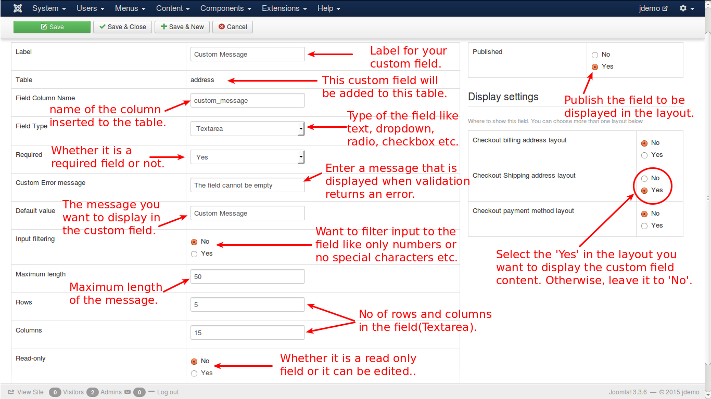

# Custom Fields

These are created for additional details to be used in checkout processes that involves billing, payment, shipping etc. For instance, 'last name' of a customer is not required for billing but it is required for shipment. So, it is created as a custom field and made to be displayed in shipping address.

There are two types of custom fields, namely, **Core custome fields** and **Non-Core custom fields**.

Custom fields that are in J2Store by default are **Core** custom fields and that are created by users are **Non-Core** custom fields.

Core custom fields can be edited as per users wish but it is not advisable to make changes to **Core** custom fields except changing the name and label of the fields.

The following is a list of **Core** custom fields:

* first_name
* last_name
* address_1
* address_2
* phone_1
* phone_2
* city
* zip
* country
* company
* email
* tax number
* zone_id
* country_id

Apart from these core custom fields, you can create your own custom fields according to your requirements.

For example, if you want to add a custom note for your reference, you can create it as a custom field and make it to be displayed in the billing or shipping process.

Check the image for a list of custom fields:

Let us see how to create a custom field.

In the custom field list view, click the **New** button. You will the get a screen as shown in the image below.

### Add a Custom Field

To add a custom field, we need to enter the following details. They are given below on by one:

* **Label** - Name of the custom field that is displayed in the layout
* **Table** - The table where the custom field is created - this is default and you can not change it
* **Field Column Name** - name of the column that is created in the table
* **Field Type** - This is the type of the field you are about to create and there are 12 types available to choose from - they are:
    * Text
    * Email
    * Textarea
    * wysiwyg editor (what you see is what you get)
    * Radio
    * Checkbox
    * Single Dropdown
    * Zone/Country List
    * Date
    * Time
    * DateTime
    * Custom Text

The remaining fields after the **Field Type** is selected, will be varying according to the type
* **Required** - Whether the field is required or not - select 'Yes' or 'No'
* **Custom Error Message** - If it is required field and left empty on data entry, this message will be displayed to alert the user
* **Default Value** - What is given here will be the content displayed, if the user do not give any input to the field
* **Input Filtering** - If you want to filter out the input to this field, you can select this to 'Yes' and set the conditions
* **Maximum Length** - The no of characters that are allowed to enter in the field
* **Rows** - No of rows that are allowed in the field
* **Columns** - No of columns that are allowed in the field
* **Read-only** - If it is set to '**Yes**', it is only readable and the content cannot be changed

### Status
* **Published** - The field has to be published by setting this to '**Yes**' to be displayed

### Display Settings
You can choose the layouts to display the field. You can select all the three layouts or any combination of layouts or only one layout. The layouts:
* **Checkout Billing Address Layout**
* **Checkout Shipping Address Layout**
* **Checkout Payment Method Layout**
