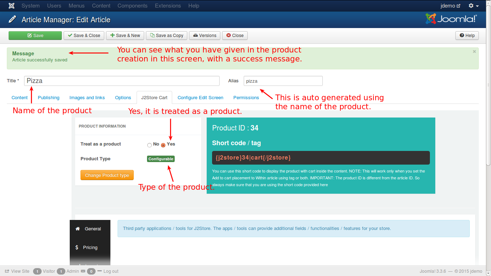
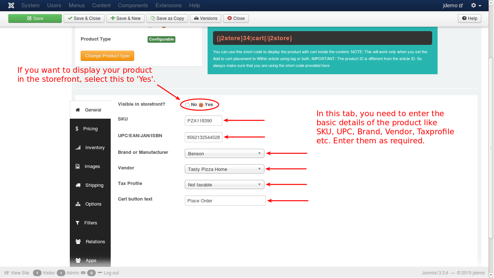
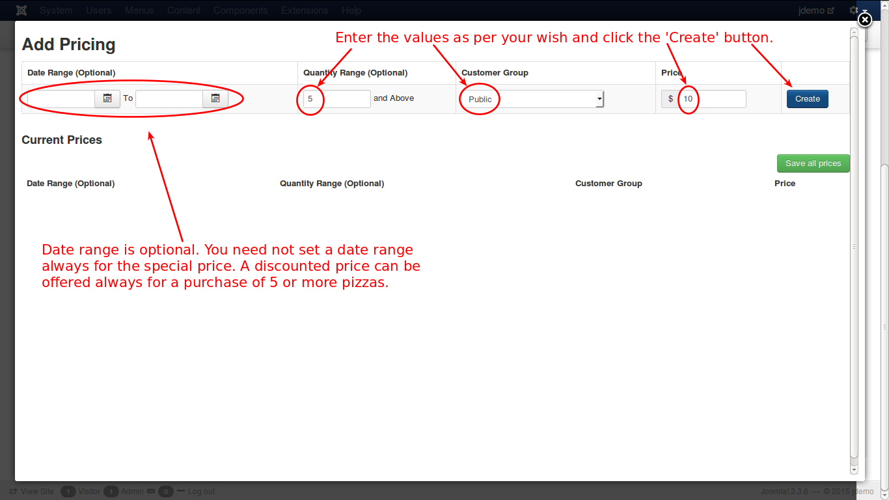

# Example to Create a Configurable Product

**J2Store** implements an innovative concept in creating products. It uses the Joomla articles as products. So to create a product is to create an article.

So, lets create an article.

### Creating an Article

Have a look at the image below:

As given in the above illustration, click in the top menu or in the left pane of the control panel. You will get a new screen like this.

A configurable product is the one that can be configured by the customer who intends to purchase the product. A suitable example is, Pizza. This basic pizza is displayed as a configurable product, and the user is allowed to add toppings over the basic product. The price of the product will be changing according to the toppings added by the customer. Follow the steps to create a configurable product.

* Enter the name for your product. 
* Since you are creating article, you need to tell that the article be treated as product. So, select 'Yes'. 
* Select the type of the product, i.e., 'Configurable'.
* Now, click the 'Save and Continue' button.

Your product is successfully created and a message will be displayed like this.

#### General
Now you need to configure your product with necessary details. Begin with general tab.

See the image below:

Enter the details as required by the fields in the tab, like, SKU, UPC/EAN, brand, vendor, tax profile and the caption for the cart button. Once you enter them now navigate to the next tab, pricing.

#### Pricing
In Pricing you can set the price for your product. You have the option to set up advanced prices, like discount offers, as shown in the following images.

In the above image you set up the regular price for the basic pizza. Click the set prices button to set advanced/special prices. It will pop-up a window to set the special prices.

Check the image below:

