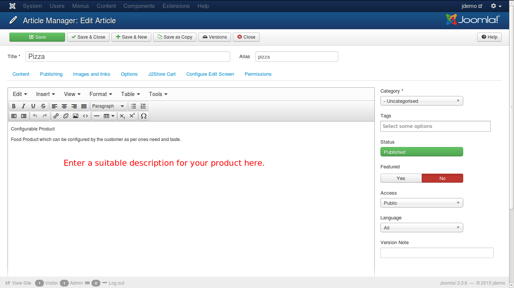
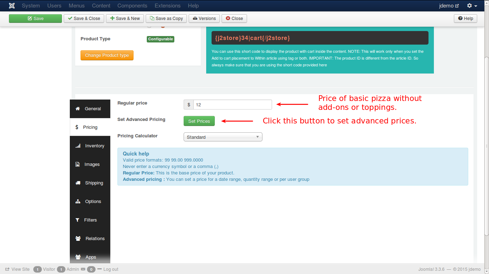
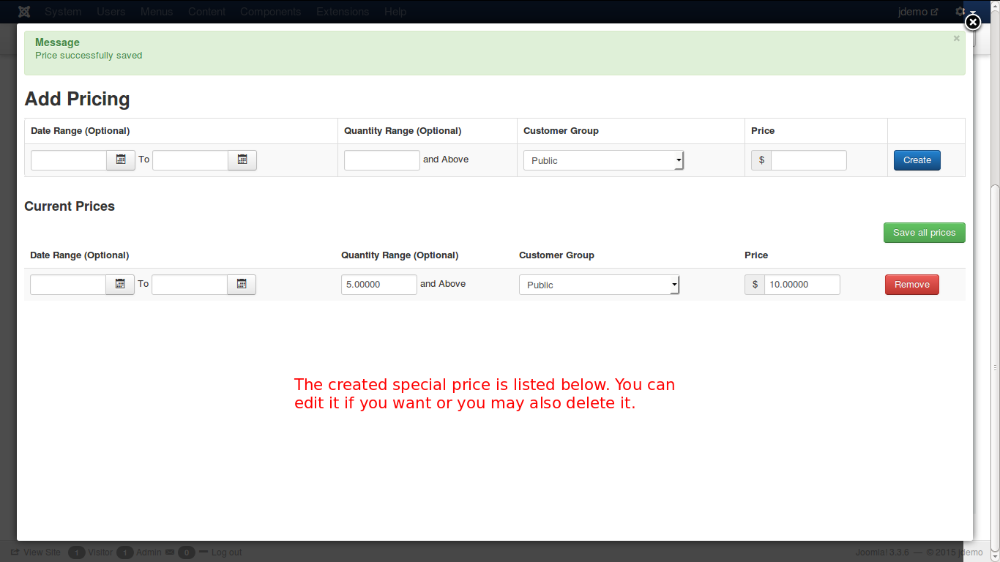
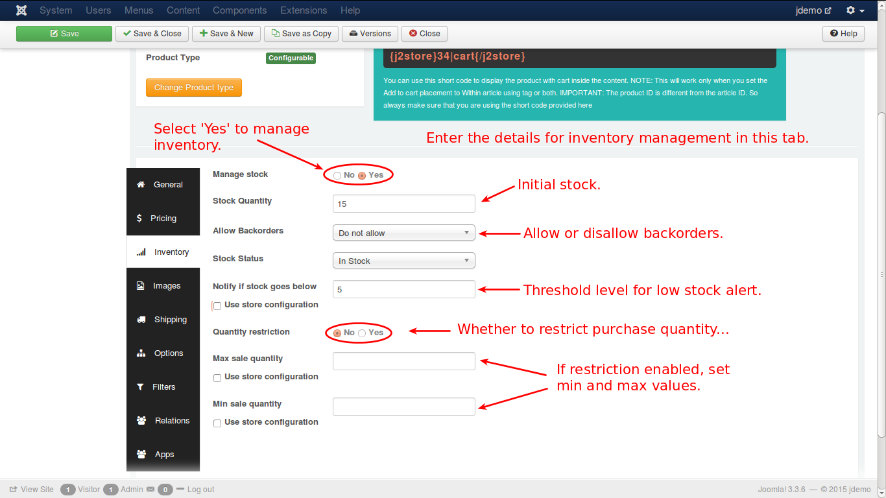
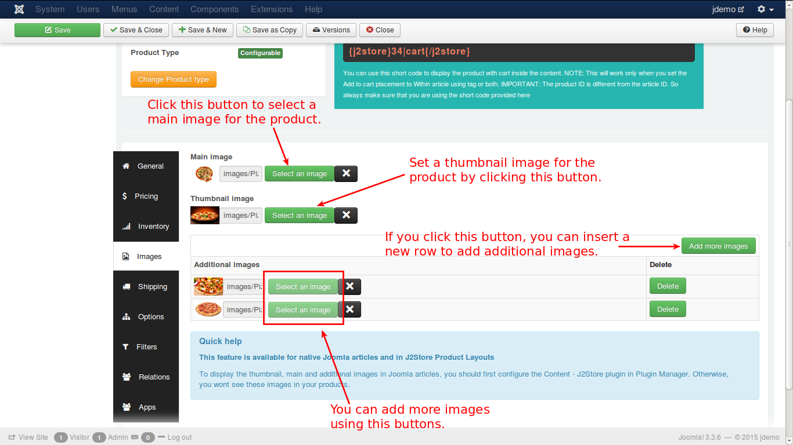
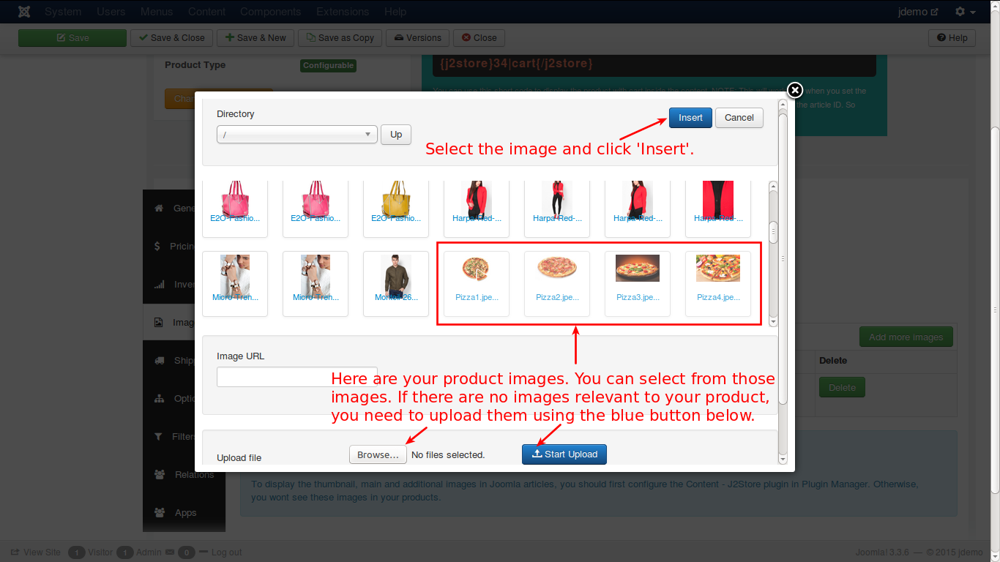
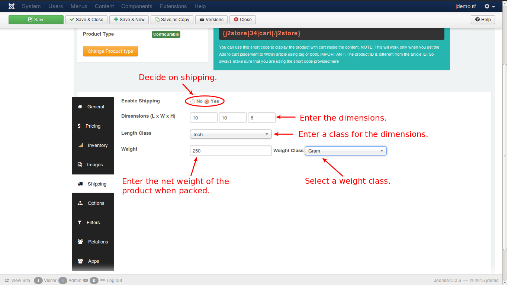

# Example to Create a Configurable Product

**J2Store** implements an innovative concept in creating products. It uses the Joomla articles as products. So to create a product is to create an article.

So, lets create an article.

### Creating an Article

Have a look at the image below:

As given in the above illustration, click in the top menu or in the left pane of the control panel. You will get a new screen like this.

A configurable product is the one that can be configured by the customer who intends to purchase the product. A suitable example is, Pizza. This basic pizza is displayed as a configurable product, and the user is allowed to add toppings over the basic product. The price of the product will be changing according to the toppings added by the customer. Follow the steps to create a configurable product.

* Enter the name for your product. 
* Since you are creating article, you need to tell that the article be treated as product. So, select 'Yes'. 
* Select the type of the product, i.e., 'Configurable'.
* Now, click the 'Save and Continue' button.

Your product is successfully created and a message will be displayed like this.

You can enter the description of your product as shown below:

#### General
Now you need to configure your product with necessary details. Begin with general tab.

See the image below:

Enter the details as required by the fields in the tab, like, SKU, UPC/EAN, brand, vendor, tax profile and the caption for the cart button. Once you enter them now navigate to the next tab, pricing.

#### Pricing
In Pricing you can set the price for your product. You have the option to set up advanced prices, like discount offers, as shown in the following images.

In the above image you set up the regular price for the basic pizza. Click the set prices button to set advanced/special prices. It will pop-up a window to set the special prices.

Check the image below:

In the above image, you can set a date range for the special price, otherwise, you can leave it empty for the special price to be applied always. For example, if a customer buys 5 or more pieces of pizza, you can offer a discount in price, throughout the year. Now, you have entered the values, and click the blue 'Create' button and you will get the special price listed below, as shown in the image.

#### Inventory

Now, configure the Inventory tab.

In this tab you set the initial stock, whether or not to allow backorders(order placement even if stock is not available), low stock alert quantity, purchase quantity restriction for any customer etc. 

Check the image below:

#### Images

Now, add relevant images for your product display in the cart. 

Here is how it can be done.

When you click on the 'select an image' button, you will see a pop-up window, where you can select the image for your product.

#### Shipping

Move on to shipping tab. Here you set up the shipping configuration for the product. Enter the dimensions, a class for dimensions, weight of the product and its class. All in packed condition.

Check the image below.

