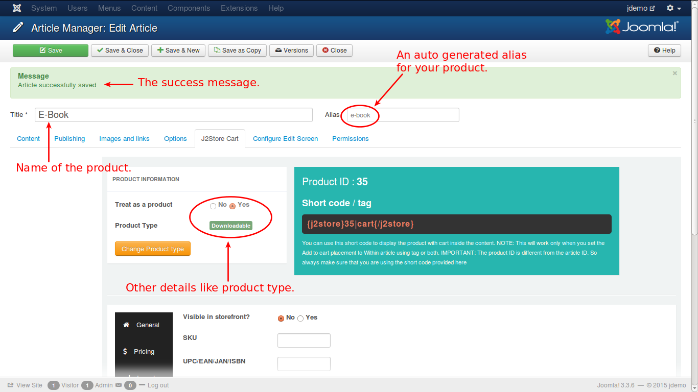
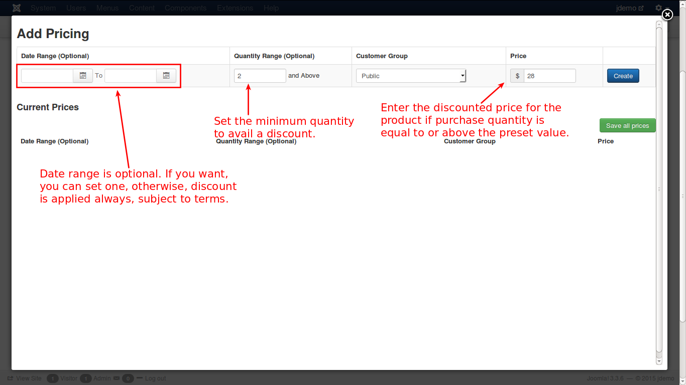
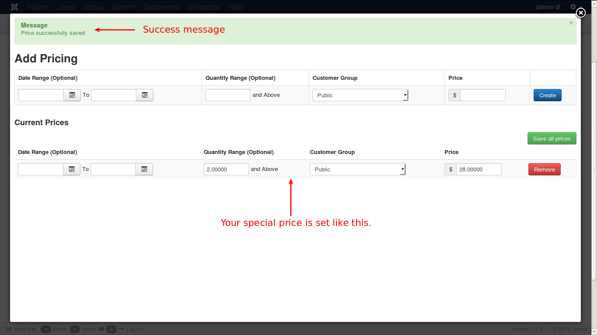
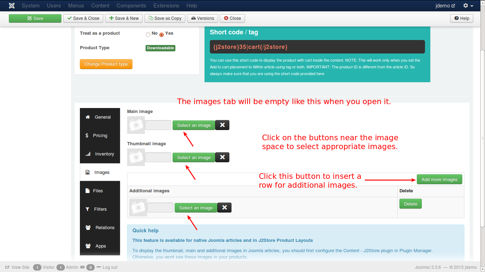

# Example to Create a Downloadable Product

**J2Store** implements an innovative concept in creating products. It uses the Joomla articles as products. So to create a product is to create an article.

So, lets create an article.

### Creating an Article

Have a look at the image below:

As given in the above illustration, click in the top menu or in the left pane of the control panel. You will get a new screen like this.

A downloadable product is one that has no physical existence. It can be downloaded as per the terms and conditions of the seller. It can be a book, a video, a music album or even a software extension like joomla extension. To create a downloadable product, follow the steps:

* Enter the name for your product. 
* Since you are creating article, you need to tell that the article be treated as product. So, select 'Yes'. 
* Select the type of the product, i.e., 'Downloadable'.
* Now, click the 'Save and Continue' button.

Your product is successfully created and a message will be displayed like this.

Add a description for the product, as illustrated below.

The Configuration process follows:

#### General

Enter the details as required by the fields in the tab, like, SKU, UPC/EAN, brand, vendor, tax profile and the caption for the cart button. Once you enter them, you can navigate to the next tab, pricing.

#### Pricing

In Pricing you can set the price for your product. You have the option to set up advanced prices, like discount offers, as shown in the following images.

In the above image you set up the regular price for the E-Book. Click the set prices button to set advanced/special prices. It will pop-up a window to set the special prices, like this.

In the above image, you can set a date range for the special price, otherwise, you can leave it empty for the special price to be applied always. For example, if a customer buys 2 or more copies of the E-Book, you can offer a discount in price, throughout the year. Now, you have entered the values, and click the blue 'Create' button and you will get the special price listed below, as shown in the image.

#### Inventory

Now, configure the Inventory tab.

In this tab you set the initial stock, whether or not to allow backorders(order placement even if stock is not available), low stock alert quantity, purchase quantity restriction for any customer etc. 

Consider the below image:

#### Images

When you select the images tab, you will get a screen like this.

Click on the select an image button. You will get a pop-up window, where you can select suitable image for your ebook, as shown below:

