# Example to create a simple product

**J2Store** implements an innovative concept in creating products. It uses the Joomla articles as products. So to create a product is to create an article.

So, lets create an article.

### Creating an Article

Have a look at the image below:

As given in the above illustration, click in the top menu or in the left pane of the control panel. You will get a new screen like this.

* Enter a name for the product you want to create.
* Select the 'J2Store Cart' tab below.
* Select 'Yes' in the option 'Treat as product'.
* The next option is product type. From the available list, select 'Simple', as shown in the image. 
* Now click the button, 'save and continue'.

Your product will be saved, and it will continue to configure the product. See the image below:

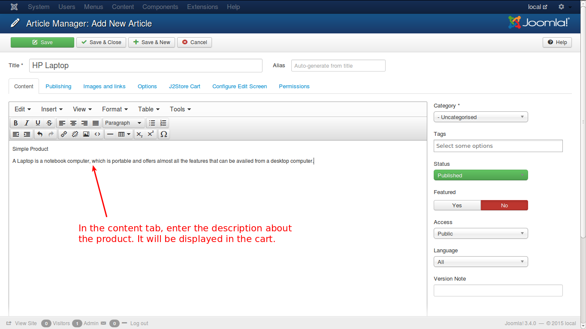

Now, add a description to your product in the editor. Lets add the other primary details of the product. See the image below.

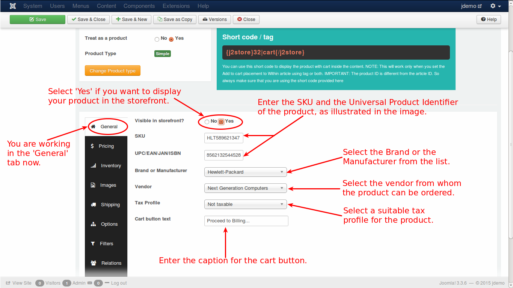

In general tab of the simple product, you can set up the basic information about the product like SKU, Universal Product Identifier, Brand etc and you can decide whether the product is to be displayed in store front. Next is pricing tab.

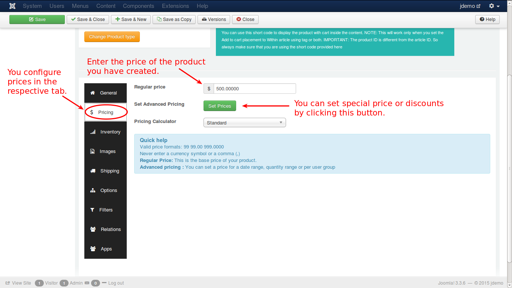

Here, enter the price of the product. If you want to set advanced prices, like special discounts, click the 'Set Prices' button ant you will get a pop-up window, where you can set the special prices. See image below to understand how it is done.

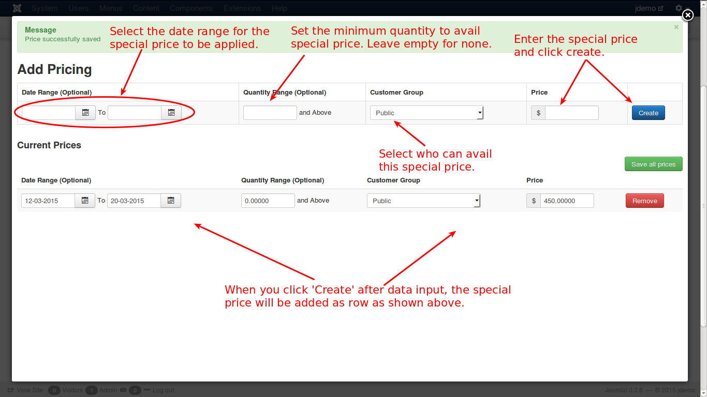

Enter the dates between which the special price is offered, the minimum quantity to avail the special price, the user group eligible, the special price and click 'Create'. Now, the new price is listed as a row below. You can further edit and save or delete if you want. Lets move to Inventory, to understand stock management.

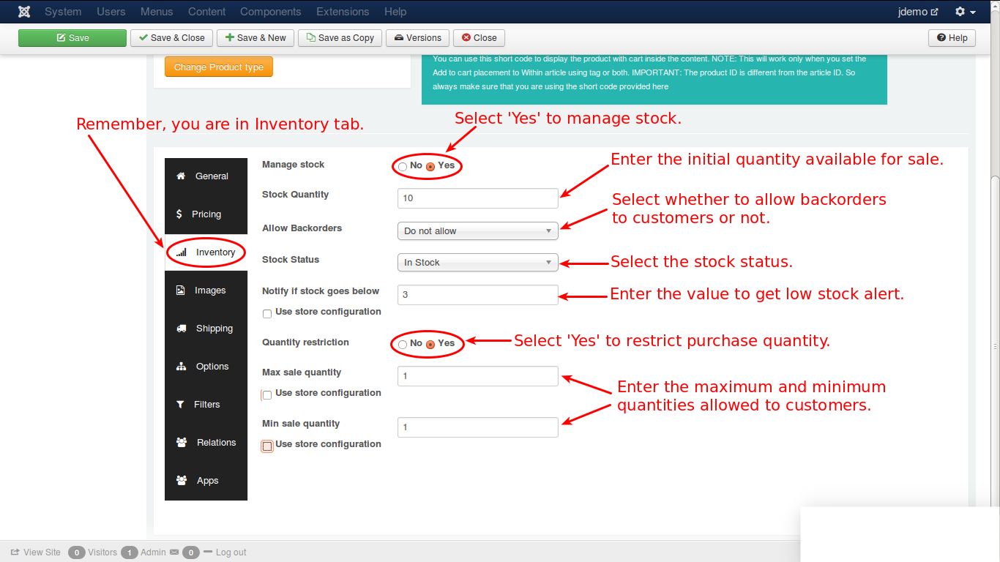

***This is a J2Store PRO exclusive feature***

Select 'Yes' if you want inventory management. Enter all the fields as required. They are fairly self explanatory, still assisted in the image. And move on to images.

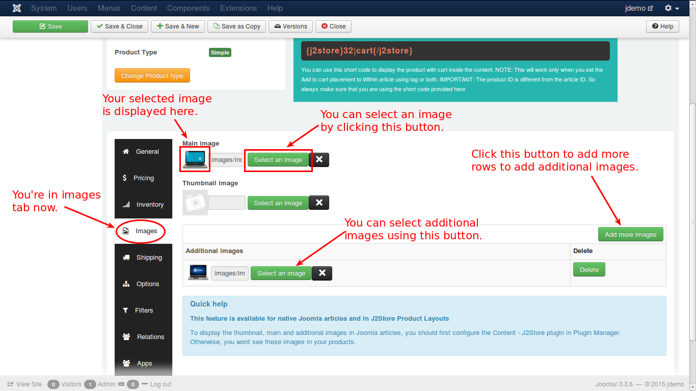

Here, you can add the images for your product. The main product image, thumbnail image, and additional images for the product are added here. To add an image, click the green button, 'Select an image', which will bring up a pop-up window, where you can select the product image. See the image below:

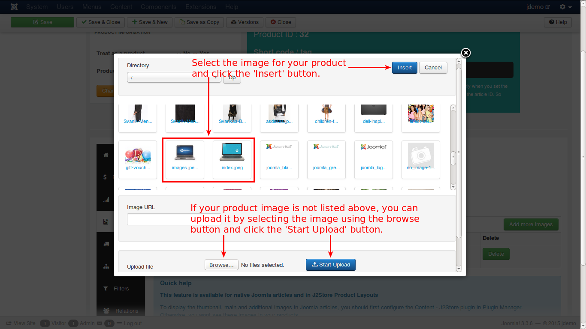

You need to load the image in the top window to select an image. To load an image, select the source by the browse button, up load it and insert it.

Now, shipping. Check the image below:

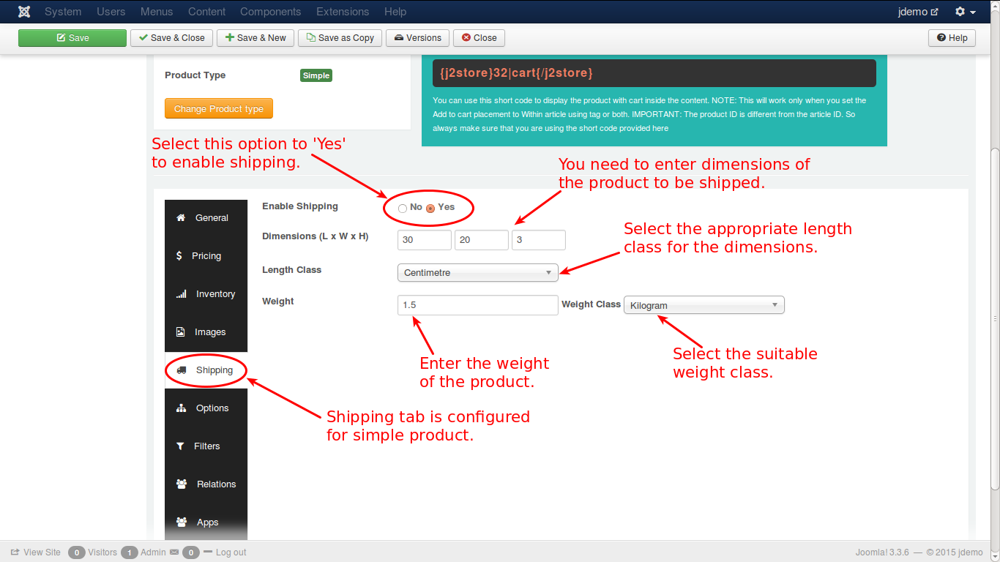

Enter the options with details according to your needs to enable shipping, the dimensions and weight of the product, classes for length and weight. Next is options. 

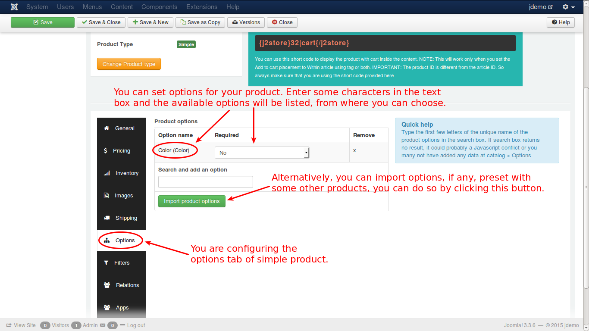

You can add options for your product, as illustrated in the image. If you have already set an option for some other product, and wish to import the same option to this product, you can do so by clicking the import product options button, which will bring out a popup window, like this.

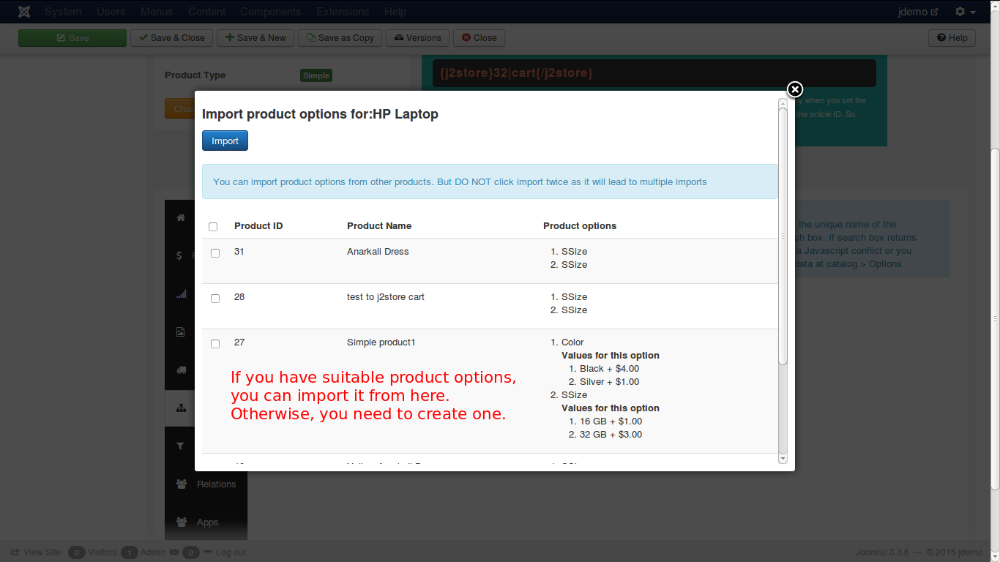

Next comes filters. You can filter the products, with their name or type to narrow the search. For e.g., if give 'Electronics' as filter, only electronics goods will be searched for your product, thus saving time. You can set filters as shown in the image.

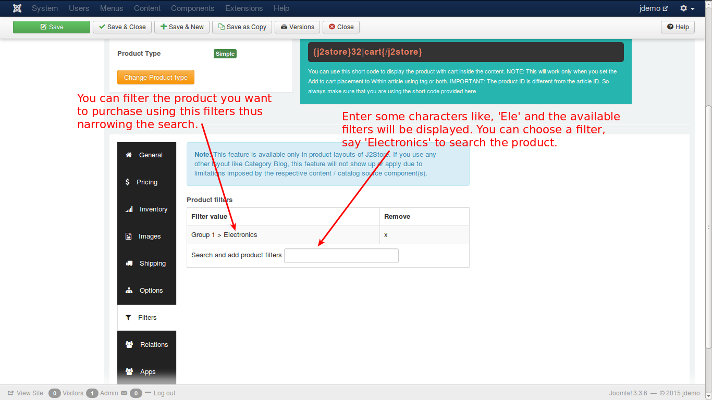

Then comes Relations. This is to promote sales by higher value products and additional products relative to the product being considered for purchase. 

For more details on this topic, see the exclusive article, detailing the tab 'Relations'.