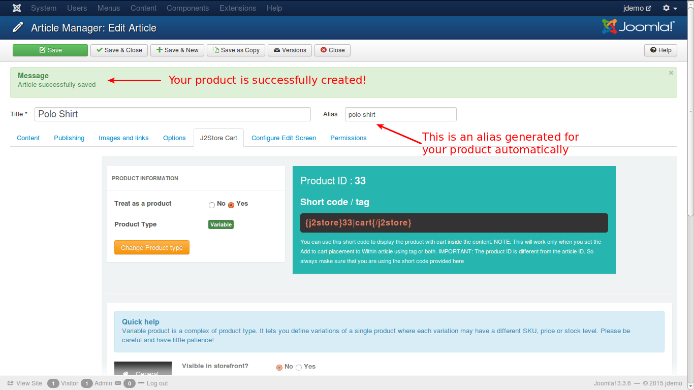
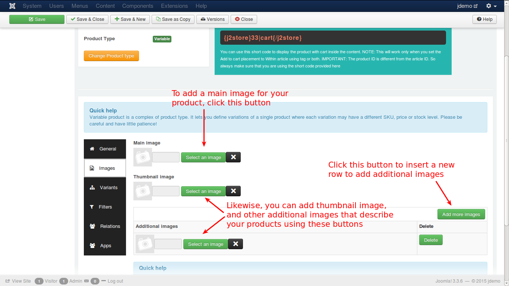
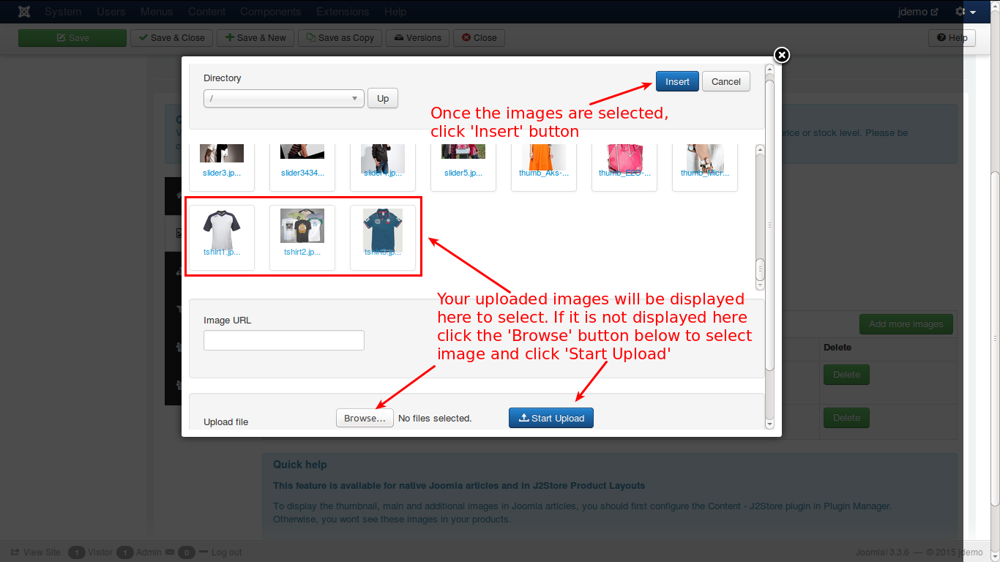
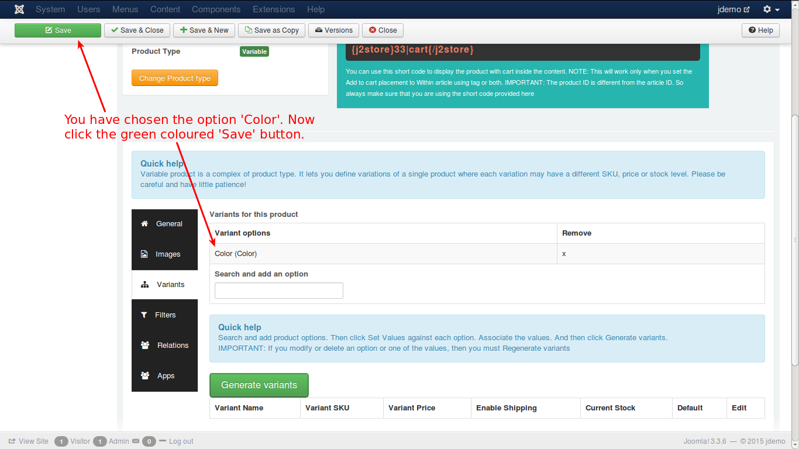
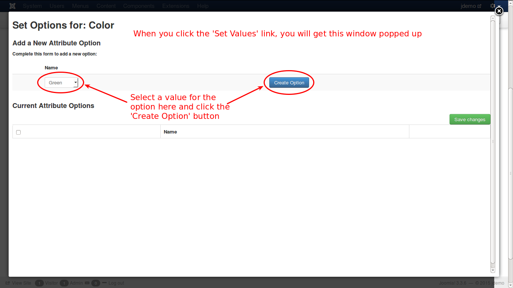
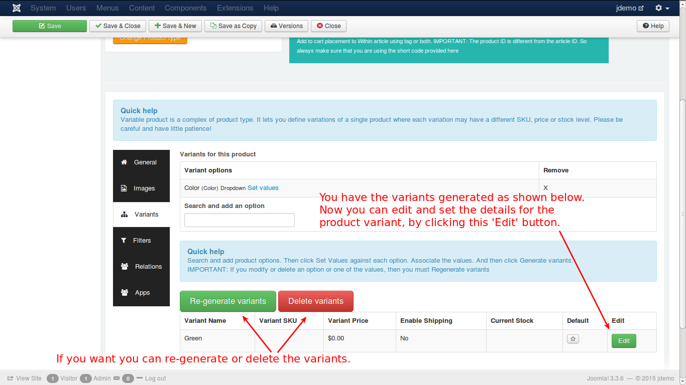
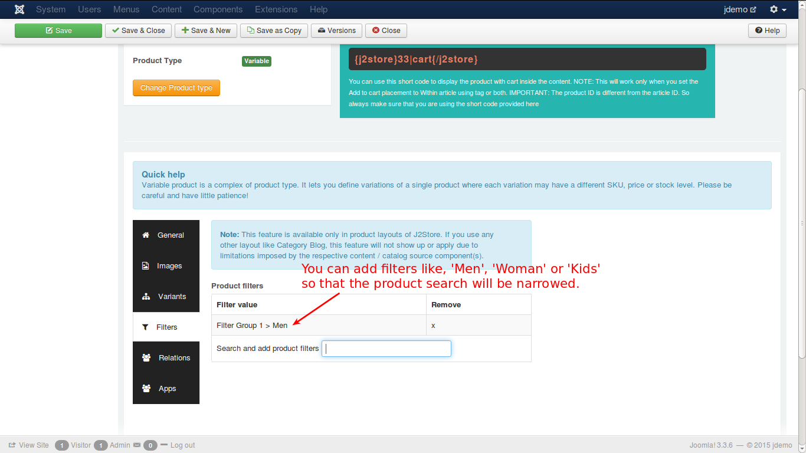
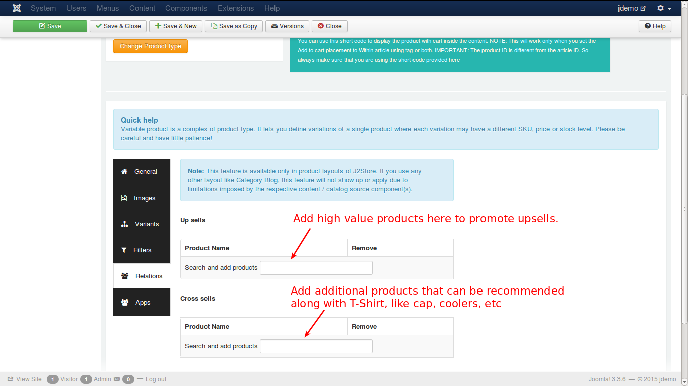
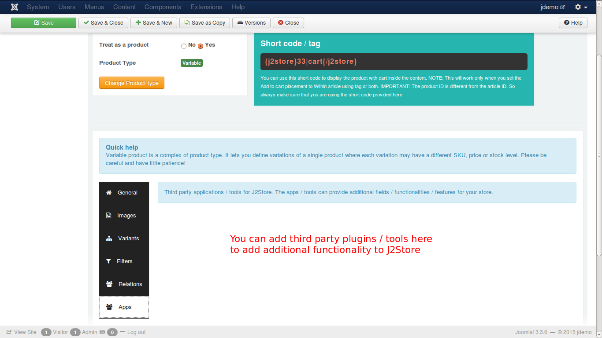

# Example to Create a Variable Product

**J2Store** implements an innovative concept in creating products. It uses the Joomla articles as products. So to create a product is to create an article.

So, lets create an article.

### Creating an Article

Have a look at the image below:

As given in the above illustration, click in the top menu or in the left pane of the control panel. You will get a new screen like this.

* Enter the name for your product. 
* Since you are creating article, you need to tell that the article be treated as product. So, select 'Yes'. 
* Select the type of the product, i.e., 'Variable'.
* Now, click the 'Save and Continue' button.

Your product is successfully created and a message will be displayed like this.

#### General
Now you need to configure your product with necessary details. Begin with general tab.

* If you select 'Yes' in the first option, your product will be displayed in the storefront
* Select the brand or manufacturer of the product from the list
* Select the vendor to order the product
* Select the taxprofile that mathces the product profile

Now switch to Images tab.

#### Images

You can add main, thumbnail and additional images relevant to your product in this tab. Click the 'select an image' button to get a pop-up window to select the image.

Move on to variants tab.
#### Variants

If you select the option, then you need to set values for the option.

In the image, as you can see, you have added the option color. Now, save the configuration by clicking ONLY the green coloured button 'Save'. DO NOT press any other button. Now, see the changes in the screen.

You can see the blue link, 'Set Values' adjacent to the option 'Color'. Click this link to set some values for the option 'Color'. Then only you can generate variants. Go ahead with setting values and see what happens...

If you select the value for the option and click the create button, you will get the resulting screen like this.

Close the window using the X in the top right corner and return to the tabs.

Now, as shown in the image, click on the 'Generate Variants', a green colored button, to generate variants for the products.

As you click the buttons to generate variants, the buttons adjusts itself to display the message 'Generating variants... please wait'. Now its done. See the variants listed below, as shown in the image.

Once the variants are generated, you can edit the variants and add necessary details to the variant. When you edit a variant, you will have all the tabs in cart except variant tab. Fill in the required details for the product variant.

Having completed variants tab, now move on to filtes tab.

#### Filters

Here, you can set the filters to narrow product search. When you set filter value as 'Mens', all mens T-Shirts will be displayed. Likewise, women and kids. See the illustration below:

#### Relations

The next tab is Relations. Here, you can add products of higher value than the one being viewed by the customer and recommend the customer to buy that product, citing its advantages and additional features. This is an upsell.

Also, you can add some other products to convince the customer to buy theses products additionally. This is cross sell.

For more detailed explanation, refer to the **Relations** section of the **Variable Product**.

#### Apps

In this tab, you can add third party tools or plugins, that are available, to enhance the J2Store functionality, like adding additional fields, applications, functions or features.

Now, lets have a look on how your product is viewed in your online store. Check the image below:

