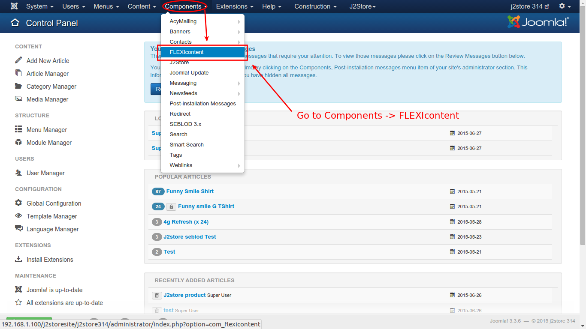
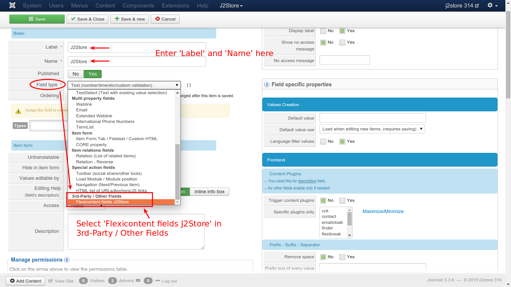
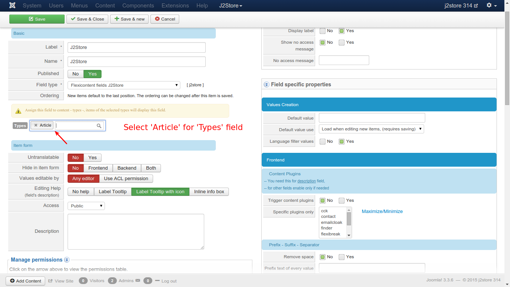
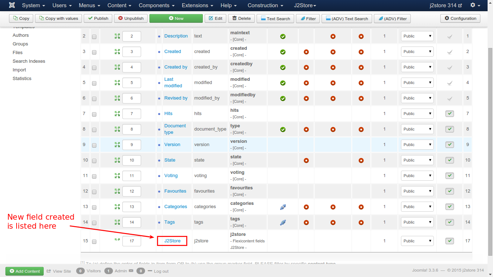

# Flexicontent

### Introduction 

  The plugin integrates Flexicontent with J2Store, thus adding E-commerce capability to Flexicontent.

### Requirements

* PHP 5.2 or higher
* Joomla 3.x
* J2Store 3 or above
* Flexicontent  
* j2store_flexicontent_unzip ( Extract this package to get installation packages )
    1. J2Store Flexicontent Fields ( plg_flexicontent_fields_j2store )
    2. System J2Store ( plg_system_flexicontentj2store ) 

#### Installation Instructions 

>**Note**: *When you download the **j2store_flexicontent_unzip** package, first unzip the package to get two zipped packages. These two packages are most important and need to be installed and enabled.*

### Installation 
1. Unzip the Package "j2store_flexicontent_unzip.tar.gz" downloaded from j2store.org and you will get two packages: *plg_flexicontent_fields_j2store.tar.gz* and *plg_system_flexicontentj2store.tar.gz*.
 
2. Use the Joomla extension manager to install both the plugins, one by one. 
3. Go to **Extensions -> Plugin Manager -> Filter** : Select type "flexicontent_fields" -> Select the Plugin "FLEXIcontent - Flexicontent fields J2Store" and enable the System Plugin.

4. Go to **Extensions -> Plugin Manager -> Filter** : Select type "system" -> Select the Plugin "System J2Store Flexicontent" and enable the System Plugin.

## Backend 
### Creating J2Store Field 
1. Go to Flexicontent dashboard, there you will find list of icons. Click on the "New Field" icon. You will be taken to create field view, here you have to enter the basic required fields.

2. Now enter the label as "J2Store Cart" and name as "j2store".
3. Set Published to **Yes**, and Choose the "Flexicontent fields J2Store" from the Dropdown list for Field type.

4. Now choose the Types as "article".
5. Save the changes.

Now you can see the "J2Store" field added and listed successfully.

### Adding Flexicontent Item

1. Go to Flexicontent dashboard, Click on the "New Item" icon. A pop-up window will open asking you to Select the type. Click "Article". You will be redirected to "New Item". Here you can see the Tab "Item type : Article" and inside the tab you can see the "j2store custom field added". Now, you can see j2store field added into the flexicontent item. Your flexicontent item is integrated with J2Store. Set **Yes** to *Treat as a product* option and click on **Save**.

2. After successfully saved, your product is created and you can configure the product with the product specific details, change the product type, set prices, etc.

3. Save the changes.

## Frontend

### Adding j2store custom field into templates

1. Go to Flexiconent dashboard and click on the *templates* icon. You will find a list of templates. Now you have to select the template in which you want to add the "j2store cart" by dragging the j2store field into the template.
    

###Creating menu 

1. Go to Menus -> Main Menu -> Add New Menu Item. Now you need to select the menu item type. To do this, click on the Select button next to the Menu Item Type label.Select the Flexicontent, and choose Categories -> Choose the list of categories  you want to display in the front end.

2. In Flexicontent layout Items Tab -> choose the layout (Make sure j2store field is added in your template) 

3. Save the changes.

