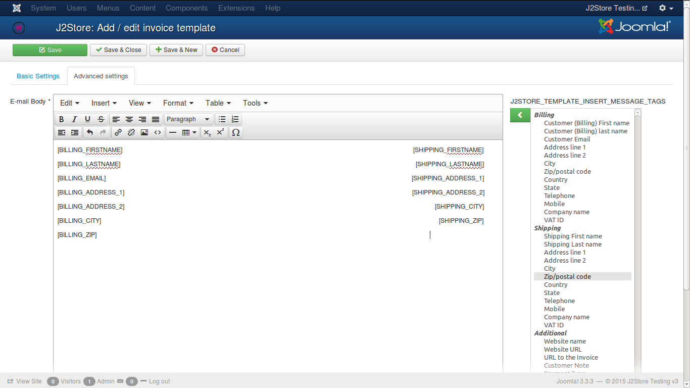

# Invoice Template

This is a default layout or design for how an invoice should be looking. There are many details in the invoice that need to be carefully arranged in order to understand the invoice clearly both by the customer and the seller.

Like email template, here too we have two settings pages to be filled up for creating an invoice template. They are
* Basic
* Advanced

The following points reveal the process of an invoice template.

### Basic
The fundamental requirements of a template. Let us see one by one.

#### Title
The title of the template. You can have as many templates as you like and hence it necessary to give a unique title to each and every template.

#### Order Status
Invoice will be generated based on the order status only. To generate an invoice, the orderstatus should be **'COMPLETED'**.

#### Language
Here you can select for which particular language this template can be used or for all the languages.

#### Groups
This states that which group can generate an invoice for e.g., groups like Administrator, Manager, Editor etc. can be able to generate invoices whereas public and guest user groups can not do so. This can be determined using this field.

#### Payment Methods
This defines the payment methods that are accepted for selling. Some payment options may not be accepted by some sellers and they may wish to avoid those options. For that it has been enabled to select the options from the available list.

#### Status
For a template to be used for invoicing, it has to be published prior to that. This field will notify that status.

### Advanced
In advanced settings, we have the invoice content. The content of the invoice can be designed here. There are so many options available to customize the content. There is a rich text editor to neatly customize the content. The facilities that are available in the editor are:
* Cut, Copy, Paste
* Insert links or images
* Formatting the text in the body like, bold,
 italicize, line spacing, underlining, and much more
* Insert tables
* Insert source code etc

By using these, an invoice can be designed like, placement of customer name, order no, order date, payment details, shipping details, product details etc. This is can be accomplished by adding suitable tags listed in the extreme right area of the page.

Check the image below for how an ivoice template can be designed for our needs. This is for example purpose only and the user can design his/her own template.

Full articles can also be added to the content, from other external sources.

