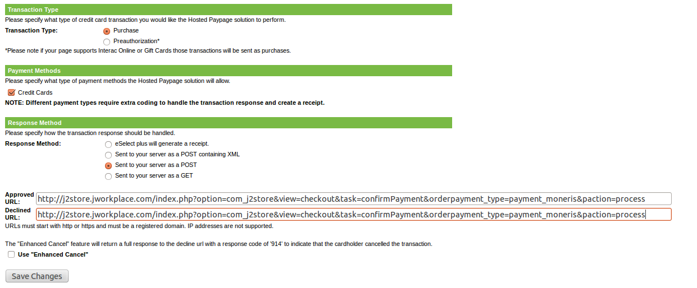

# Moneris Payment Plugin

The plugin integrates the **eSELECT Plus Hosted Paypage** method of Moneris Payment gateway with J2Store.

#### Installation
Use the Joomla extensions installer to install the plugin.

#### Configuration
**Moneris account**

You need to set up your **Moneris eSELECT Plus Hosted Paypage**.
The following configuration steps are required under your **Moneris eSELECT Plus** merchant account. Please ensure you have your merchant account set up on moneris before continuing.

**Step 1** : Log into the Merchant Resource Center

Developement : https://esqa.moneris.com/mpg/index.php

Production : https://www3.moneris.com/mpg

Before you can send a transaction to the Hosted Paypage you will need to configure several settings through the eSELECTplus Merchant Resource Centre (MRC).

To log into the MRC test environment go to https://esqa.moneris.com/mpg and use one of the following login Ids.

| Store ID | User Name | Password |
| -- | -- | -- |
| Store 1 | demouser | password |
| Store 2 | demouser | password |
| Store 3 | demouser | password |

**Step 2**: Navigate to Admin -> Hosted Config

Once you have successfully logged in, click on the “ADMIN” menu item on the left and then in the submenu that appears click on “HOSTED CONFIG”.

**Step 3**: Create Hosted Paypage configuration:

To create a new Hosted Paypage configuration, click on “Generate a New Configuration”.

You will be assigned a Hosted Paypage ID (**ps_store_id** ). 

This is the identifier for this unique configuration. You will also be assigned a Hosted Paypage Key (**hpp_key**). Note down the **ps_store_id** and **hpp_key** . You will need these while setting up the plugin.

**Step 3.1**: Set Transaction Type to Purchase (default).

**Step 3.2**: Under Payment Methods, ensure Credit Cards is enabled, all others disabled.

**Step 4**: Response Method

Set Response Method to Sent to your server as a POST.

Set Approved URL and Declined URL to:

https://YOUR_HOST/index.php?option=com_j2store&view=checkout&task=confirmPayment&orderpayment_type=payment_moneris&paction=process

See the screenshot below

**Step 4.1**: Choose "Use Enhanced Cancel"if you want to return a full response to decline url. Click the *Save Changes* button.

**Step 5**: Configure Response Fields

Click on the Configure Response Fields button.
**Enable Return the txn_number.** 

This field is used to perform follow-ons and leave all others disabled.

Click *Save Response settings*.

Then Click the Return to Main Configuration.

**Step 6**: Configure Security

Click the Configure security button. In the Transaction Verification section, Enable Transaction Verification.

Set the Response Method to: Sent to your server as a POST

Enter the following url in the Response URL field:

https://YOUR_DOMAIN/index.php?option=com_j2store&view=checkout&task=confirmPayment&orderpayment_type=payment_moneris&paction=verify

See the screenshot below

In the above image, click **Save Verification Settings** and then return to **Main Configuration**.

**Plugin Configuration**

Go to Joomla admin → Plugin Manager and open the Moneris Payment plugin.

The plugin has following options:

**Payment option title**

The value entered here will be used as the title for this payment method. Customer will see this value when he checks out.

**PS Store ID**

The **ps_store_id** generated in your merchant account in the previous steps.

**HPP Key**

hpp_key generated in your merchant account in the previous steps.

**Use Sandbox**

Set yes to test the integration of the plugin with the Moneris development server.

**Article ID for Thanks Message**

You can create a Joomla Article to say thanks to the users, who purchased in your online store. Enter the article ID here.

**Display text on selection**

The text entered here will be displayed when customer selects this payment method.

You can enter a language constant as a value here if you are using a multi-lingual site and then write a language override. 

Refer the tips below

>Tip - ONLY FOR MULTI-LINGUAL SITES

For example, enter a language constant:

J2STORE_TEXT_TO_DISPLAY_ON_SELECTION.

Now you can go to Joomla admin-> Language Manager->Overrides and create overrides for the language constant in all your languages.

**Display text before payment**

The text entered here will be displayed to the customer at the order summary screen before he makes the payment.

You can enter a language constant as a value here if you are using a multi-lingual site and then write a language override. Refer the Display text on selection parameter.

**Display text after payment/order**

The text entered here will be displayed to the customer after he makes the payment.

You can enter a language constant as a value here if you are using a multi-lingual site and then write a language override. Refer the Display text on selection parameter.

**Display text on error in payment**

The text entered here will be displayed to the customer when there is an error in the payment process.

You can enter a language constant as a value here if you are using a multi-lingual site and then write a language override. Refer the Display text on selection parameter.

**Display text on cancel payment**

The text entered here will be displayed to the customer when he cancels the payment at the gateway (NOT in your site).

You can enter a language constant as a value here if you are using a multi-lingual site and then write a language override. Refer the Display text on selection parameter.

**Payment Button Text**

The text of the payment button. The button will be displayed at the final checkout step.

#### Support

Still have questions? You can post in our support
forum: http://j2store.org/forum/index.html

Thank you for using our extension.