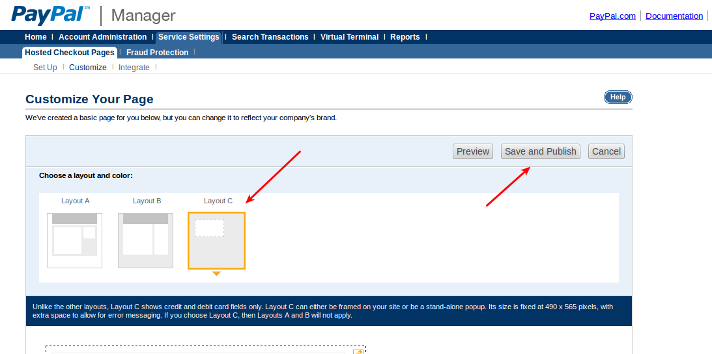
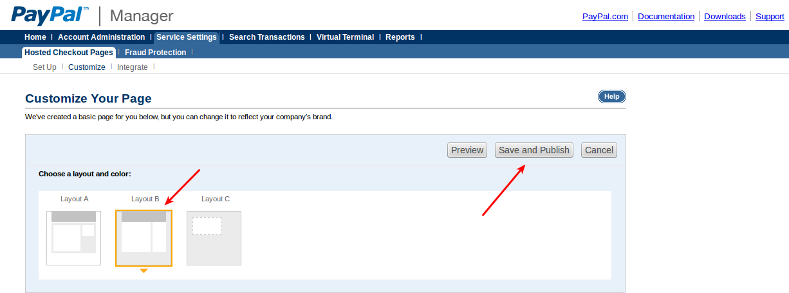
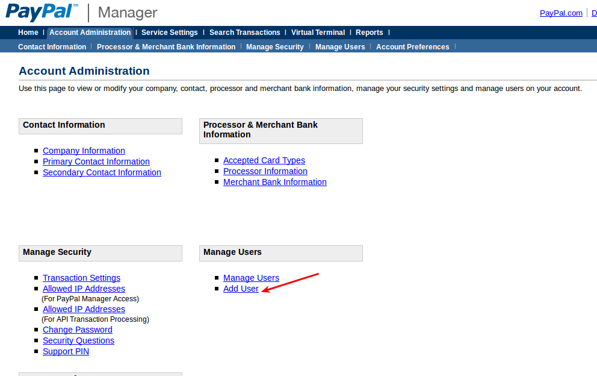

# Paypal Advanced Payment Plugin

PayPal Payments Advanced is a PCI-compliant solution. Even customers without a PayPal account can make purchases through PayPal’s secure payment gateway using the credit card. Accepted cards include Visa, MasterCard, Switch/Maestro, and Solo credit cards in the United States. 

PayPal Payments Advanced is available only for merchants in US and Canada.

#### Requirements 
* PHP 5.3 or higher
* Joomla 2.5.x
* J2Store 2.0.2 or above 

#### Installation Instructions 

Use the Joomla installer to install the plugin like you do for other extensions

#### Configuration
##### Step 1: Configure Your PayPal Account

Before you begin, you must configure your PayPal Payments Advanced account on the PayPal website. 

**Log in to your PayPal Advanced account at manager.paypal.com. **

Go to **Service Settings -> Hosted Checkout Pages -> Set Up**, and make the following settings:

* 1 - Set Transaction Process mode to TEST or LIVE depending on your requirement.

* 2 - Under the Billing Information

**Make these fields required:** Check CSC box

**Make these fields editable:** Check CSC box

See the picture below

* 3 - Under the Payment Confirmation, set

**Show confirmation page:** On my website

**Return URL Method:** POST  (This is very IMPORTANT)

* 4 - Under Security options, set

• AVS: No
• CSC: No
• Enable Secure Token: Yes

Save the settings.

##### Step 2: Customise the Layout

In J2Store Paypal advanced plugin settings, you can choose the Payment window type.

**If you chose, Payment window type as: Your Website (Using iFrame):**

In Paypal manager, go to Service Settings > Hosted Checkout Pages> Customize. Choose the Layout C. 

See the screenshot below

**If you chose, payment window type as Redirect :**

In Paypal manager, go to Service Settings > Hosted Checkout Pages> Customize. Choose the Layout B

Click Save and publish.

##### Step 3 (Optional): Create a user

PayPal recommends that you set up an additional user on your account. To set up an additional user, do the following:
1. Go to manager.paypal.com and log in to your account. 
2. Follow the instructions to set up an additional user. 
3. set "Select a Predefined Role:" as "FULL_TRANSACTIONS"
4. Save the changes. 

#### Configuring the Plugin

Go to Joomla admin → Extensions → Plugin Manager → Paypal Payments Advanced plugin.

##### Payment option title
The value entered here will be used as the title for this payment method. Customer will see this value when he checks out.  Default: Paypal Payments Advanced

##### Vendor/Merchant Login:
The Merchant Login with which you login to Paypal Manager.

##### User:
Your User ID. If you created a new user, then enter that user id here. If not, then this  field should carry the same value as the Vendor/Merchant Login.

##### Password:
Your password with which you login to Paypal manager.

##### Partner:
Your PayPal partner ID. By default, it will be PayPal. 

##### Transaction Type:
The type of transaction. If you choose SALE, then the payment will be captured immediately after a customer makes the payment. If you choose Authorization, then Payment will not be captured. You will have to capture it manually by going to Paypal Manager. Default value: Sale

##### Test mode: 
Set this to YES, only if you have set the Transaction Process Mode to TEST in the Service Settings->Hosted Checkout pages → Set up. 

>IN LIVE SITE, THIS SHOULD BE SET TO NO. 

##### Article ID for Thanks you message: 
You can create an article to say thanks, provide some information or instructions to the customers, who purchased in your online store. Enter the Article ID here. This will show, 
when customers return from the paypal. 

