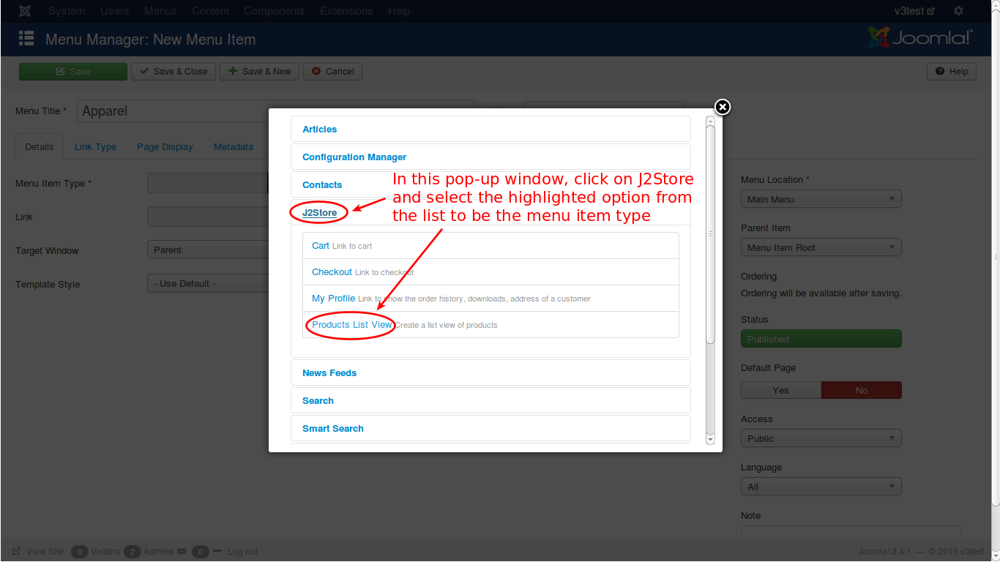
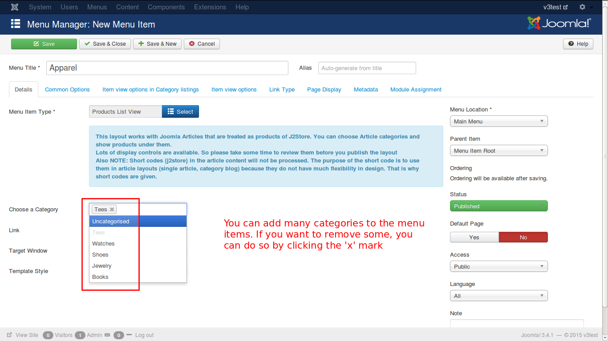
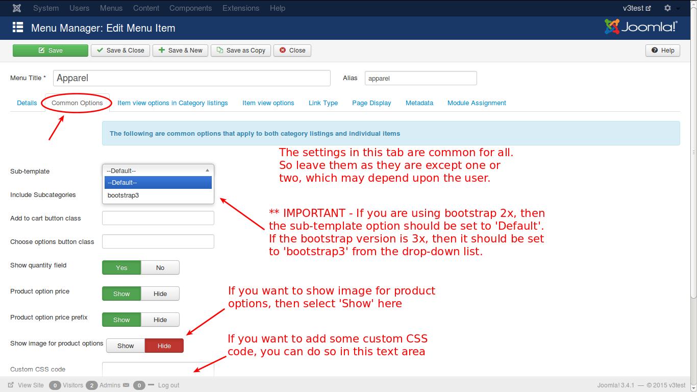
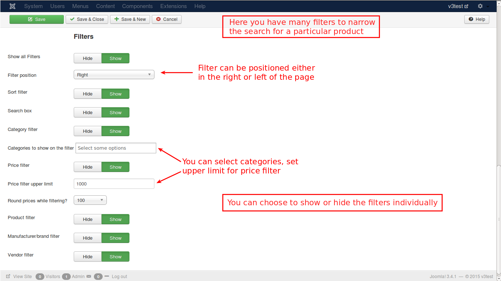
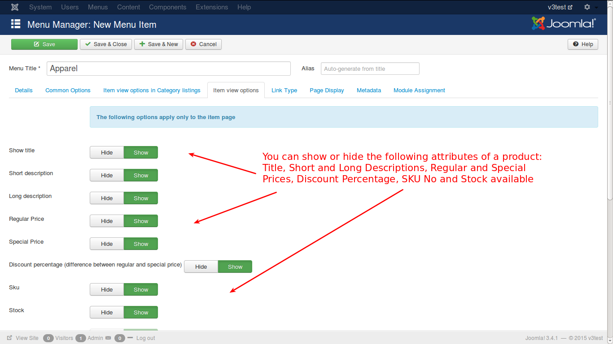
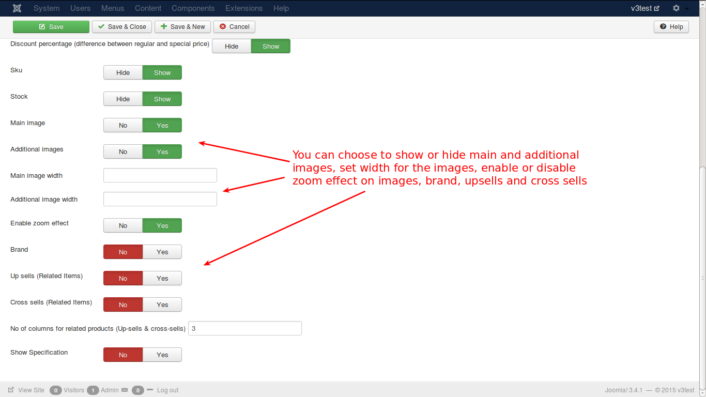
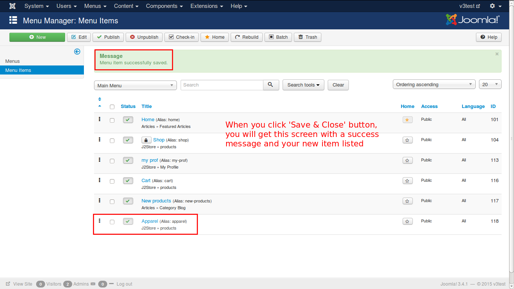
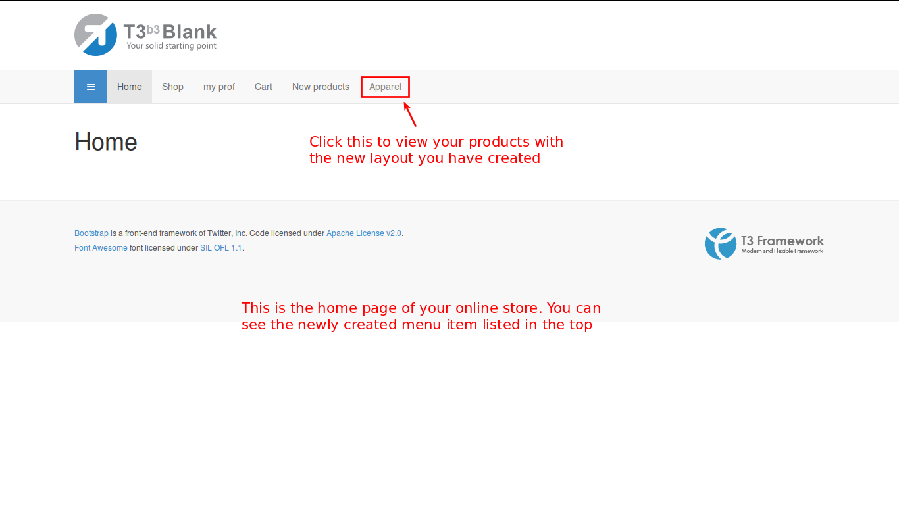
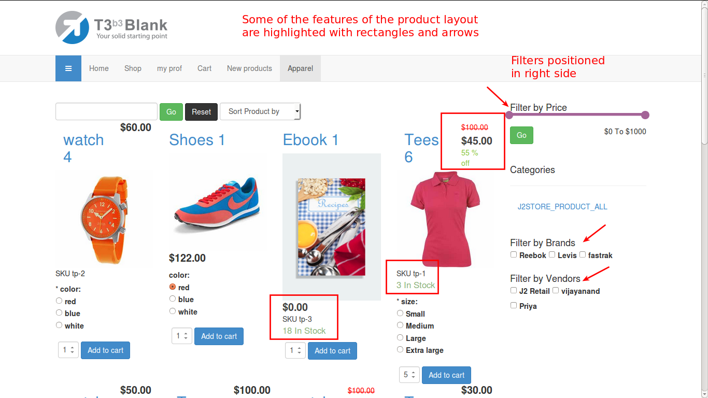

# Product Layout

Product Layout is a powerful feature that enables the user to customize the display options and descriptions of the product. In this section, you'll learn how to create and customize a product layout.

### Create a Product Layout
To create a product layout, go to joomla control panel and click on the menu item **Menus -> Main Menu** as shown in the image below.

You will get the list of menus that are already present as shown in the image below.

To create a new item, click on the **New** button and you will get this page.

First you need to enter the title of the item you create. For example, it is entered with **Apparel**. The alias will be automatically generated based on the title.

Then, you have several tabs in this page. Let us see one by one. First is the **Details** tab.

#### Details Tab
Here, you choose the **Menu Item Type** by clicking on the 'Select' button. You will get a pop-up window like this:

In this pop-up window, select **J2Store** and you will get a list to choose from. From the list, select **Products List View** and close the window. You will see your selection as shown in the below image.

Your menu item is selected and the link is also created automatically. click on the **Choose a Category** text box to choose the product categories under the name Apparel, viz., T-Shirt, Kids Wear, etc. You can add many categories in this box. Refer the image below.

Now, go to next tab, **Common Options**.

#### Common Options Tab

This tab has the common settings for all items. If you want to show images for product options or if you want to add some custom CSS code, you can do that here. Otherwise, you can leave them as they are.

>Note: In Sub-Template option, you have to choose **bootstrap3** if your bootstrap version is 3x. Leave it as **--Default--** if bootstrap version is 2x

#### Item View options in category listings
Check the image below:

In this tab, you are setting the configuration for how to display the product in the cart and the features and options to display with the product.

You can display any number of products as you like in the shop. Enter the no of products to be displayed in the text box provided and the number of columns in which the product display is divided.
As the no of products increases, the image display size will be decreased. 

Also, select all other options as per your choice. Refer the next image.

From the image you can see that there are many options available to set the price, image, size of the image and many more attributes.

Next image shows the filters.

Filters help narrow the search for a particular product. There are many filters available for the search. 

* Sort Filter
* Search Box
* Category Filter
* Price Filter
* Product Filter
* Manufacturer / Brand Filter
* Vendor Filter

One or more filters can be applied as per the needs of the customer.

#### Item View Options Tab

In this tab, you will set the configuration for what to display with the product, like price, description, image etc.

See the image below:

This image shows the options you have to set the configuration for a product on what has to be displayed along with the product. The available options are: 

* Title
* Short Description
* Long Description
* Regular Price
* Special Price
* Discount Percentage
* SKU
* Stock
* Main Image
* Additional Images
* Main Image Width
* Additional Image Width
* Enable Zoom Effect
* Brand 
* Upsells
* Cross Sells
* No of columns for related products
* Show Specification

Using this parameters, you can determine what are the details and how they should be displayed in the online shop.

Apart from these four tabs, there are four more tabs and they should be left with the default settings. You need not worry about that.

Now, Save the item by clicking the **Save & Close** button. You will get the screen as shown in the image below.

Now, let us see how this is viewed in the shopping page. 

In this image, you can see that the new menu item created is listed in the top with the other menu items. You can click that to see the products of your store, like the image below.

In this page, you can see the product layout features. The filters are positioned in the right side as per the selected choice. You have the option to filt by price, brand, vendor etc. The regular and special prices are also displayed along with discount percentage variation. 

Let us see how images are added in the backend and how they are displayed in frontend view.

Consider the image below:

In the image, you can see Main and Additional images added to the product configuration. When you configure your product, you will add images of the product for its view in the cart. You add main image of the product for the main view supported with additional images.

Check the image below: 

When you click on the product, it will be displayed with large image and additional images displayed below in small size. When you hover over the small images, you can see them in place of the main image. The below image explains this activity.

Like this, you can set different product layouts according to your wish and needs.

