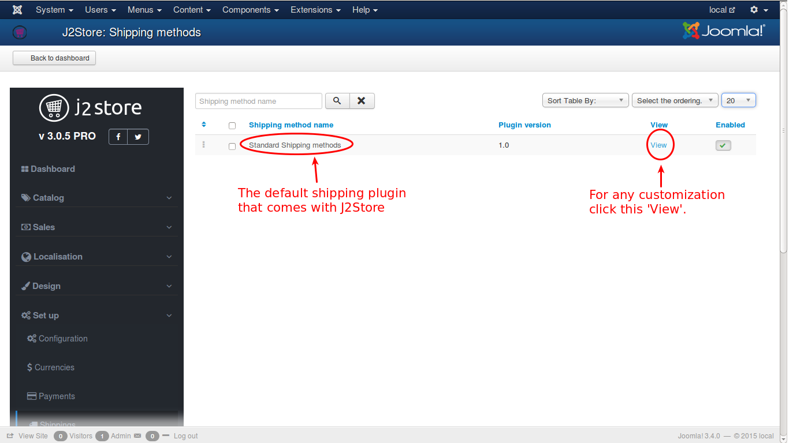

# Shipping Methods

J2Store implements multiple, geozone based shipping methods. This view lists out all the shipping plugins available. By default, j2store comes with the Standard Shipping Methods plugin, which implements seven methods

In this section, you can understand the functionality of shipping methods with some examples.

The shipping methods screen will look like this:

### Standard Shipping Methods

This is shipping plugin which is available in J2Store by default. It has seven shipping types. They are:

**1. Flat rate per order**

**2. Quantity based per order**

**3. Price based per order**

In this type of shipping, the total order value will be considered for calculation of shipping cost. For e.g., if the order value is upto $ 1000.00, the shipping cost may be fixed at $ 30.00 and for order values from $ 1001.00 to $ 2000.00, the shipping cost may be fixed at $ 25.00 and so on.

**4. Flat rate per item**

A fixed rate of say, $ 5.00 is applicable for each and every item in the cart. Then it will be multiplied with the total number of products i.e., if the total number of products purchased is 10 nos, then shipping cost will be $ 5.00 X 10 which is $ 50.00.

N.B.: In this type, only one rate can be configured per geozone and weight will not be considered for shipping cost.

**5. Weight based per item**

In this shipping type, the cost of shipping depends upon the weight of an item that is to be shipped. If an item weighs between 1 and 50 kilograms, the shipping cost may be fixed at $ 15.00 for that item and if it weighs between 51 and 100 kilograms, it's shipping cost may be fixed at $ 25.00 for that item.

**6. Weight based per order**

This type of shipping is calculating the cost based on the total weight of the order items. If a cost of $ 10.00 is charged for weights upto 50 Kilograms, and $ 20.00 is charged for weights between 51 and 100 Kilograms, then an order having a total weight of 70 kilograms will attract a shipping cost of $ 20.00.

**7. Price based per item**

The shipping cost in this type is calculated using the price of each item. So, price ranges are predefined and for every price range, a specific shipping cost can be charged.

