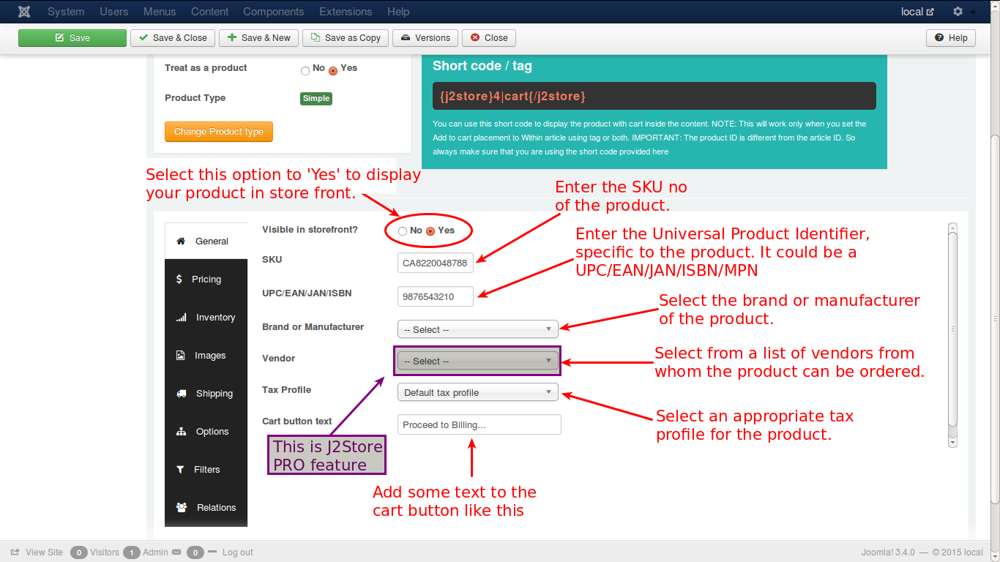

# Simple Product

A simple product has the following options to be set in various tabs.

See the image below:

#### Pricing
* Enter the regular price for the product
* There is an option to set advanced pricing if any discounts or privileges are exercised for the customers and that settings are done here. A time period, quantity limitation, user group and discounted price can be set for availing any discounts
* Pricing calculator can also be selected provided one or more pricing calculators should be predefined
* A handy quick help is also available in the tab itself regarding price format and advanced pricing

#### Inventory
* Manage Stock - Select **Yes** or **No**
* Enter the stock quantity
* Choose from the options whether or not to allow backorders
* Select stock status
* Set threshold for notification of low stock
* Choose whether quantity is restricted and if Yes, set the limits for minimum and maximum quantity for a purchase

#### Images
* Select the main and thumbnail images for the products
* Add more images if necessary

#### Shipping
* Enable or disable shipping
* Set the dimensions for length, width and height
* Set the length class i.e., inch, centimetre or millimetre
* Enter weight and set the weight class like Kilograms, grams or pounds

#### Options
* Either create an option for the product like color, size etc or an option can be imported from the available records

#### Filters
* Add any filters to narrow up the search for products

#### Relations
* In this tab page relations set for Upsells and Cross sells
* An ***upsell*** is to get the customer to spend more money – buy a more expensive model of the same type of product, or add features / warranties that relate to the product in question.
* A ***cross-sell*** is to get the customer to spend more money buy adding more products from other categories than the product being viewed or purchased.
* **Example**:
    The terms cross-sell and upsell are often used interchangeably because, let’s face it, this gets confusing. Say the customer is viewing a Laptop with 2GB/500GB for $500.

    * 4GB/500GB-> $550 - Upsell, same product family, more expensive
    * 4GB/1TB -> $700  - Upsell, same product family, more expensive
    * Laptop Bag -> $25 - Cross sell, related product, additional sell
