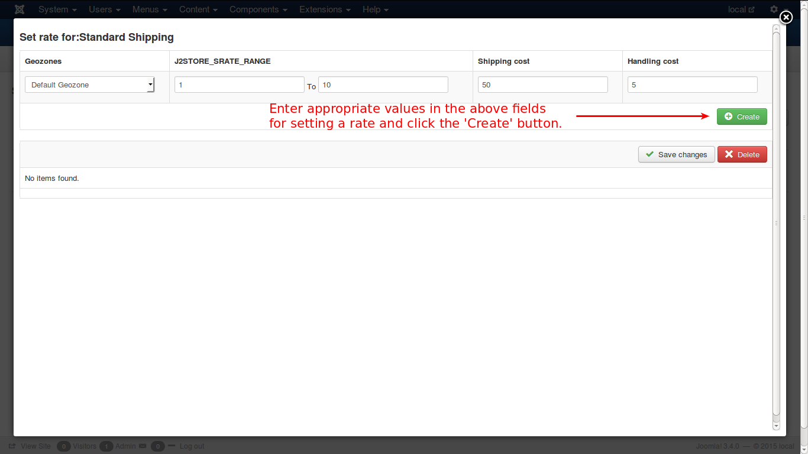

# Standard Shipping Methods

This is shipping plugin which is available in J2Store by default. It has seven shipping types. They are:

* **[Flat rate per order](#flat_rate_per_order)**
* **[Quantity based per order](#quantity_based_per_order)**
* **[Weight based per order](#weight_based_per_order)**
* **[Price based per order](#price_based_per_order)**
* **[Flat rate per item](#flat_rate_per_item)**
* **[Weight based per item](#weight_based_per_item)**
* **[Price based per item](#price_based_per_item)**

 ## Flat rate per order

A fixed rate will be charged for every order. For e.g., if the shipping cost is levied at $ 50.00 for every order, then the shipping cost is set to $ 0.00. This type of shipping can be termed as Store Pickup Method or Free Shipping Method.

See the image below on how to configure this shipping type.

You can give a meaningful name for the **Shipping Method** so that the customer understands it easily.

Select a suitable **Tax Profile** from the available list.

For any shipping method, to make it available for selection, always ensure that it is **Enabled** with '**Yes**'.

Select the **Flat rate per order** in the list.

If the shipping address needs to be overridden with store address, you can select it here.

Finally, set the minimum and maximum subtotals that are required for availing this shipping type.
 
 
 
 ## Quantity based per order
 
 
 
 ## Weight based per order
 
 
 
 ## Price based per order
  
 
 ## Flat rate per item
 
 
   
 
 ## Weight based per item
 
 
    
 
 ## Price based per item
 
 
See the image below:

When you click on the shipping method name, you will be directed to this screen.

When you click 'set rates', you will be presented with this view:

After entering the data, click on the 'Create' button and you will get this:
