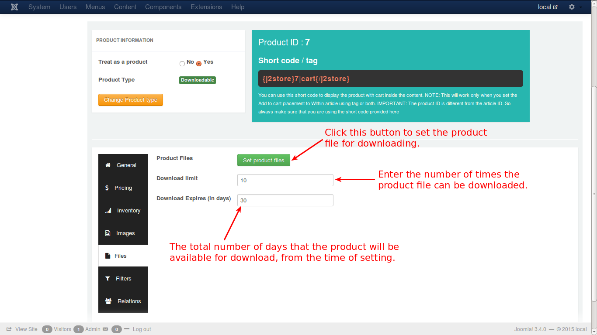
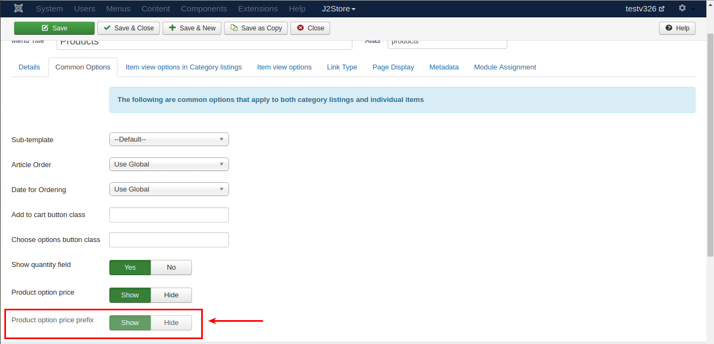
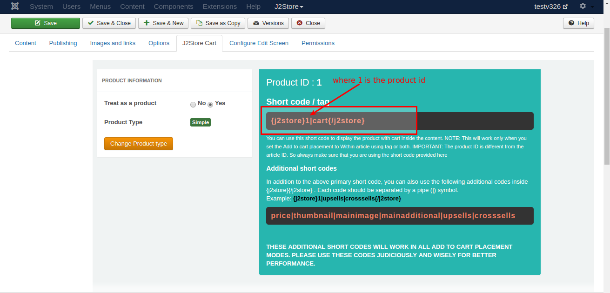
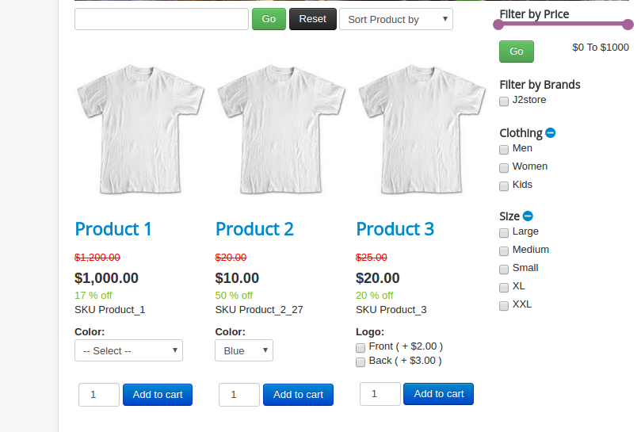
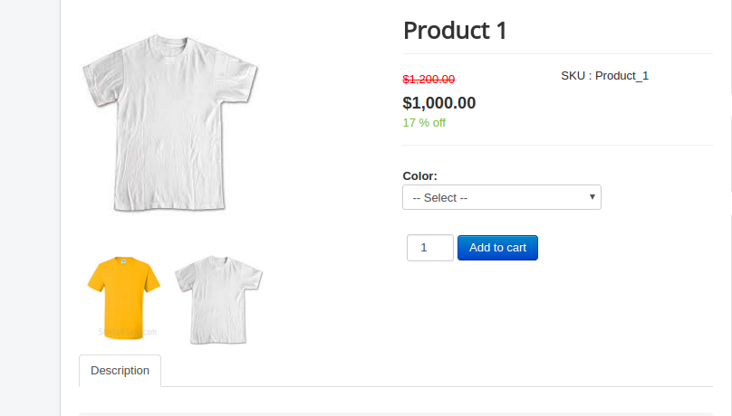
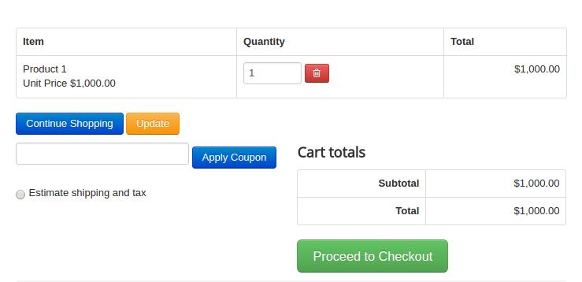
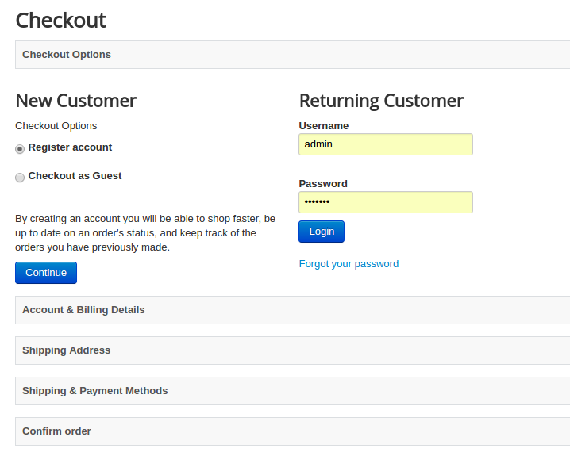
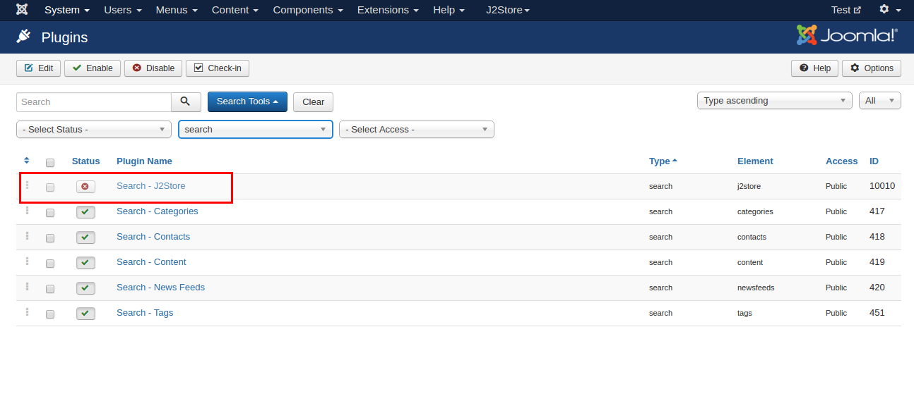
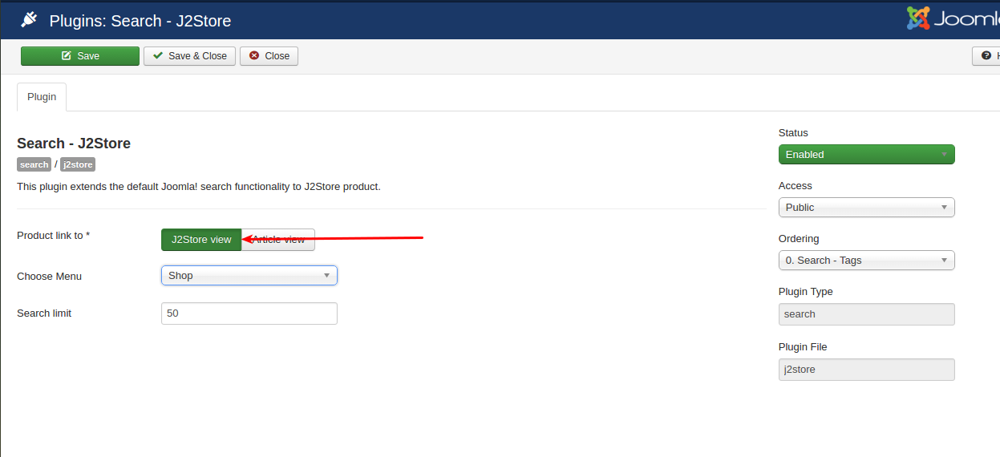

#Troubleshooting Common Issues

* **[[HOW TO]Fix enter your valid Address information Error](#valid_address_error)**
* **[Change default country in checkout](#change_default_country)**
* **[Order products in list layout](#order_products)**
* **[Options from dropdown cannot be selected](#options)**
* **[solve jQuery conflict with Multi-categories component](#multicateogries)**
* **[Writing template override for the frontend order view and print layouts](#template_override)**
* **[Troubleshooting Checkout issues](#checkout_issues)**
* **[How To Solve Mini Cart module related issues](#mini_Cart_issues)**
* **[HOWTO make checkout address field labels language friendly](#checkout_field_language)**
* **[Selling Digital Goods Online with J2Store](#digital_folder)**
* **[HOW TO override the layout of Add to cart block](#override_addtocart)**
* **[How to create a new currency in J2Store?](#currency)**
* **[Joom SEF configuration for J2Store](#joomsef)**
* **[How to Remove + and - Prefix in Product Option Price](#remove_prefix)**
* **[I don't see Add to Cart Button. What is the problem?](#no_add_to_cart)**
* **[HOW TO move Add to Cart Button using the Short Plugin tag](#move_cart_button)**
* **[HOW TO Disable Shipping Address step and Payment Methods in Checkout](#disable_shipping_payment)**
* **[HOW To Translate the Address Field Labels](#translate_addr_fields)**
* **[HOW TO change the colour of add to cart buttons](#color_cart_button)**
* **[Writing a Layout override for Joomla article manager - An intro image](#override_intro_image)**
* **[HOWTO solve javascript conflict between some of RocketTheme templates and J2Store](#rocket_js_conflict)**
* **[HOWTO create a custom thank you message](#thank_u_message)**
* **[HOWTO translate j2store / fix language and translation related issues](#lang-translate_issues)**
* **[How to translate payment option title](#payment_option_title)**
* **[Hiding Product Options And Cart Button In Category View](#hide_cart_button)**
* **[Override Product Layout](#override_product_layout)**
* **[HOW TO set up and enable SSL in Joomla](#enable_ssl)**
* **[How to solve the product link in search results](#j2store_search)**

<a name="change_default_country"></a>
##[HOWTO] Change default country in checkout

1. Login to Joomla administrator and go to Components -> J2Store

2. Go to Set up - > Custom fields

3. Open the Country field and choose your default country. Save.

4. Open the Zone ID field and choose your default zone. Save.

5. Clear Joomla cache and check.

<a name="order_products"></a>
##[HOWTO] Order products in list layout
The product list layout by default takes the ordering in the Article Manager. However, you can change this ordering (on page load / refresh) via the Menu Parameters.

NOTE: This tutorial applies only for those using the J2Store's Product List Layout in Version 3. If you use the default article layouts, refer the Joomla documentation on ordering of articles.

Login to Joomla administration and open the menu that links your product list.

Under the Common Options tab, you can find Article Order parameter. There you can choose the ordering method.


<a name="options"></a>
##[HOWTO] Options from dropdown cannot be selected

This issue occurs when your site has two instances of the Jquery UI library.


**In Version 3:**

Go to Configuration - basic settings
Set the Load Jquery UI to Only Front End.
Save

**In Version 2 :**
Go to J2Store - Options - Basic settings
Set the Load Jquery UI to Only Front End.
Save.

<a name="multicateogries"></a>
##[HOWTO] solve jQuery conflict with Multi-categories component

If you are using the Multi-cateogies component (which adds the ability to choose more than one category for your articles), you might experience a jQuery conflict with J2Store. Here is a quick fix

Are you using Multi-categories component ?
If yes, then the issue comes due to loading of multiple Jquery UI instances.

Here is a quick fix

Open /administrator/components/com_j2store/helpers/strapper.php

Around line 33, you will find

$document->addScript(JURI::root(true).'/media/j2store/js/j2storejqui.js');

Change this to

if($mainframe->isSite()) {$document->addScript(JURI::root(true).'/media/j2store/js/j2storejqui.js');}

Save.
Logout. Clear browser cache and test.
This should fix the issue.

<a name="template_override"></a>
##Writing template override for the frontend order view and print layouts

This tutorial applies to J2store 3.x versions.

You will nedd to use your hosting CPanel file manager or an FTP client like filezilla to carry out the following tasks.

The following file control the display of order details in frontend.

orderitems.php = This controls the display the order details in email and invoice template(frontend order view)

Let us see how to override the orderitems.php

Copy /components/com_j2store/views/myprofile/tmpl/orderitems.php

to

/templates/YOUR_TEMPLATE/html/com_j2store/myprofile/orderitems.php

Edit the file /templates/YOUR_TEMPLATE/html/com_j2store/myprofile/orderitems.php

Make your changes / overrides. Save.

You need to do the same if you want to override

<a name="checkout_issues"></a>
##Troubleshooting Checkout issues

The checkout steps in J2Store use AJAX extensively in order to provide customers with a better online shopping experience. Customers do not have to wait for the checkout pages to refresh. The entire checkout is handled within a SINGLE PAGE and the checkout steps are loaded in an accordin style.

If your checkout steps are not working, then follow the checklist here to troubleshoot

####Javascript conflicts

Since checkout steps are loaded in real-time using Ajax, any Javascript conflict in your site might affect the process. You will see the Checkout steps not unfolding or when you press continue button, nothing will happen.

**Solution:** Installing and configuring a Javascript manager like jQuery Easy plugin will solve most of the issues. If the problem remains unsolved, follow the troubleshooting method described below.

**Troubleshooting Method:** Open your website in the Google Chrome browser. Open the browser menu and go to Tools -> Developer Tools

You can see the Developer Tools window opening at the bottom of the browser. Navigate to the Console tab.


Now Refresh your website, add a product to cart and go to checkout. The Console tab will now show you javascript conflicts, if any, in the site. It will also show you the file name and the line number that produce the error. Take a screenshot and send it to us and also send a copy to your template provider. We will check and get back to you with the solution.


####Issue with Account Registration and FreeBSD

Sometimes, customer will not be able to pass the Account Registration and Billing step. To solve this issue, please make sure that the Allow Registration is set to YES in Joomla Administration - Users - Options

If the problem continues, go to Joomla admin - system - System Information tab.

IMPORTANT NOTE: The following instruction applies only to those running PHP on a FreeBSD operating system.

Check the value for PHP Built On. It tells you the Operating system of your hosting server.  If it says, FreeBSD, then contact your host. In FreeBSD, the Filter extension is not enabled by default. Enabling it solves the problem. More information can be found [in this thread](https://forums.freebsd.org/threads/30465/)

####Checkout goes in Loop

Sometimes, customers will be redirected from the Shipping and Payment step to the first step (Loop). Or you may not be able to proceed when you click Continue at the Billing or the Shipping step.

Solution: Go to Users -> Options

Make sure the following fields are set as per the configuration given below. And then do a purchase and see if the checkout works fine.


If you still face issues, then there could be several reasons for this behavior. Please create a private ticket (Go to the support menu ) and provide super user logins. One of our developer will help you troubleshoot and solve the problem.

####Could not proceed to payment step. Stuck at the Shipping step

Make sure you are not having any old template overrides. If you are using a template like JSN One, you might be having template overrides for checkout layout.

Go to /templates/<YOUR_TEMPLATE>/html/com_j2store

Do you see a folder named: checkout

If yes, rename it as: old_checkout

Now check.

<a name="mini_Cart_issues"></a>
##How To Solve Mini Cart module related issues
J2Store's Mini Cart is a very handy tool for your customers when they shop. They can check the number of items in their order and the total. The cart module is refreshed in real-time using an AJax request. On a few occasions, the cart may not get updated on a real time. Here is a checklist that should help you solve the problem.

####Cache settings
Go to Joomla admin - Global configuration - System tab.

Caching is like taking a snapshot of your pages and presenting the same to every visitor coming to your site (untill the cahce is refreshed again).

Since the cart module handles dynamic data, it should be excluded from caching. In order to exclude the module from caching, your Global cache setting should be set either to Conservative Caching or Disabled. Check the screenshot below.

If you use Progressive Caching, Joomla will override the Cache settings in the module. The cart module might work fine in smarller sites with Progressive Caching enabled but if you have a larger site with a large number of visitors, then it might cause issues with the module.


####Module settings

Go to Joomla admin - Module Manager - J2Store Cart module

In the Advanced tab, set the Caching to No Cache.


####Javascript conflict

Since the J2Store updates the cart module using an AJAX request, it is important that your site does not have any javascript conflicts.

Javascript conflicts mostly occur due to loading of multiple jQuery libraries or the lack of a Javascript library. it is possible that a third party extension / module in your site might be using an older or incompatible javascript library, which might produce a conflict.

Solution A:

Please download and install a jQuery Script manager like jQuery Easy and configure it. This should solve most of the issues

Solution B:

It is not exactly a solution. Its a troubleshooting method. Open your website in the Google Chrome browser. Open the browser menu and go to Tools -> Developer Tools.

You can see the Developer Tools window opening at the bottom of the browser. Navigate to the Console tab.

Now Refresh your website. The Console tab will show you if there are any javascript conflicts in your site. It will also show you the file name and the line number that produce the error. Take a screenshot and send it to us and also send a copy to your template provider. We will check and get back to you with the solution.


####JSON support

While most of the hosting service providers enable the JSON support for PHP by default, some do not. It is easy to check if JSON is enabled or not in your hosting account.

Go to Joomla admin - System - System Information - PHP Information

You can check whether JSON support enabled or not in the PHP Information tab. if you do not find any mention of JSON, then you can assume that it is not enabled for your account. You should get in touch with hosting service provider, who can enable the JSON support for your account.

You can look for something like below in the PHP Information tab.


<a name="checkout_field_language"></a>
##HOWTO make checkout address field labels language friendly

In a multi-lingual Joomla site, the checkout step doesn't convert to other language and seems to still show in english. How to make it appear in your own language ?
Simple, just rename the custom field labels as follows and it will quickly consider picking the language strings from your local language pack.

Still if you do not see the translation, please check your language pack for the following strings and translate them in your language.

language file location /administrator/language/en-GB/en-GB.com_j2store.ini

J2STORE_ADDRESS_TYPE="Address type"
J2STORE_BILLING_ADDRESS="Billing Address"
J2STORE_SHIPPING_ADDRESS="Shipping Address"
J2STORE_ADDRESS_DETAILS="Address Details"
J2STORE_ADDRESS_FIRSTNAME="First name"
J2STORE_FIRST_NAME="First Name"
J2STORE_ADDRESS_LASTNAME="Last name"
J2STORE_LAST_NAME="Last Name"
J2STORE_ADDRESS_USER_ID="User ID"
J2STORE_ADDRESS_USERNAME="Username"
J2STORE_ADDRESS_LINE1="Address Line 1"
J2STORE_ADDRESS1="Address Line 1"
J2STORE_ADDRESS_LINE2="Address Line 2"
J2STORE_ADDRESS2="Address Line 2"
J2STORE_ADDRESS_CITY="City"
J2STORE_CITY="City"
J2STORE_ADDRESS_ZIP="Zip / Postal code"
J2STORE_ADDRESS_STATE="State"
J2STORE_ADDRESS_COUNTRY="Country"
J2STORE_ADDRESS_PHONE="Phone"
J2STORE_ADDRESS_MOBILE="Mobile"
J2STORE_ADDRESS_FAX="Fax"
J2STORE_ADDRESS_COMPANY_NAME="Company"
J2STORE_ADDRESS_TAX_NUMBER="Tax Number"
J2STORE_ADDRESS_ZONE="Zone / Region"
J2STORE_TELEPHONE="Telephone"
J2STORE_ADDRESS_EDIT="View/Edit Address"
J2STORE_SHOPPER_ADDRESSES="Shopper Addresses"

<a name="digital_folder"></a>
##Selling Digital Goods Online with J2Store

Selling ebooks, PDF, images and files online is easy with the J2Store Joomla shopping cart. Here is a step-by-step guide to set up your digital downloads.

####Step 1: Let us create a folder on your site to upload the files

You can use your Hosting Providers CPanel File manager or an FTP client like FileZilla to access your web root (public_html / www / httpdocs )

Once you are in the web root, create a folder. Let us name it as: myfiles

####Step 2: Protect the folder from outside access

**We do not want people to access this folder using their browser and download files. So let us protect this folder using a .htaccess file.**

Create a file called htaccess.txt in your computer and open it with your favorite text editor
Add the following lines to it

order deny, allow
deny form all

Save the file. Now upload it to the folder we just have created in our web root. In our example, it is **myfiles**

**IMPORTANT:** Rename it as .htaccess

All the files uploaded to this folder is now protected.

####Step 3: Point J2Store to use the files in this folder.

Go to Joomla admin - j2store - Configuration - Basic settings.

In Folder path for digital goods, enter the name of the folder that contains your files. In our example, it is: myfiles

Save the configuration.

####Step 4: Creating your first digital product

J2Store uses Joomla articles as products. So head to Joomla admin -> Article Manager and create an article.

Fill in the title, description, add an image and set all other fields and Save.

Go to J2Store cart tab and set all the fields and Save.

Now go to files tab in the navigation you can see Set product files button.



<a name="override_addtocart"></a>
##HOW TO override the layout of Add to cart block

Sometimes you need to customise the Add to cart block and style it in a way you like. With J2Store, you can achieve this by writing a template override.

####To change the Add to cart block and style in category view

copy /components/com_j2store/templates/default/default_cart.php

to

/templates/<YOUR_TEMPLATE>/html/com_j2store/templates/default/default_cart.php

**IMPORTANT:** If you are using bootsrap 3 as a sub-template, replace the default with bootstrap3(/components/com_j2store/templates/bootstrap/..)

####To change the Add to cart block and style in item view

copy /components/com_j2store/templates/default/view_cart.php

to

/templates/<YOUR_TEMPLATE>/html/com_j2store/templates/default/view_cart.php

Make the changes and save.

<a name="currency"></a>
##How to create a new currency in J2Store?

J2Store allows you to sell in multiple currencies. You can create as many currencies as you like. You can either set the exchange value of the currency manually or allow J2Store to fetch in real-time from the Google Financial API. (In Store configuration, you should set the Auto update currency to YES)

This tutorial shows you how to create a new currency in your Joomla online store.

####Step 1: Create a new currency

Follow this guide to create new currency http://j2store.org/support/user-guide/currency.html

####Step 2: Choose your default currency

Go to Joomla admin - J2Store - Setup - configuration - store

Choose your Default Currency. Example: If you want to use EUR as the default currency, choose it.

Set the Auto update currency to YES.

Save.

####Step 3: (Optional) Publish the currency switcher module

This step is useful only for those using two or more currencies on their site.

Go to Joomla admin - Extension - Module Manager

Publish the J2Store Currency module to a position. This displays a currency switcher.

<a name="missing_currency_symbol"></a>
##Solving the missing currency symbol in your store

When you install, J2Store sets USD as the default currency. When store owners change the currency code, they often forgot to update their default currency in their store profile.

When you see the currency symbol missing, it is an indication that:

1. You have either changed the currency code or deleted the USD and then created a new currency for your country.

2. You forgot to reflect these changes in the Store profile.

Solution
Go to J2Store admin -> Set up - > -> configuration -> Store

Choose your Default Currency.

**IMPORTANT:**Hit the Save button. Even if you see your currency is selected by default, it may not be saved in the store profile database. Since it is the only currency available (you deleted the USD or any other currency), the dropdown list shows the first currency available.

So CLICK the SAVE button.

Still not seeing the Currency symbol, open your store again and click SAVE again.

<a name="joomsef"></a>
##Joom SEF configuration for J2Store

If you are using JoomSEF along with J2Store, you will need to make simple change in the configuration.

Go to JoomSEF configuration -> Advanced Configuration. Change the Set Page base href value to Yes - always use only base URL.

<a name="remove_prefix"></a>
##How to Remove + and - Prefix in Product Option Price

Store owners sometimes want to hide the + (PLUS) and the - (MINUS) prefix that is shown along with the product options. In J2Store Version 3, you turn off the price prefix with a switch.

####Default Joomla article layouts (like Category blog layout):

Go to J2Store - Configuration - Product tab.

Set Product option price prefix to HIDE

Save

####Product list layout:

If you use the J2Store's product list layout, then you will find a similar switch in the menu parameters.

Open the menu that links your product list layout and go to Common Options.

Set Product option price prefix to HIDE

Save


<a name="no_add_to_cart"></a>
##I don't see Add to Cart Button. What is the problem?

Don't worry. This is often a simple configuration mistake. We have answered this question more than hundred times.

This post explains the reasons behind this. Make sure you check the following points before writing to us or posting in the forums.

**Step 1:**

  Go to Joomla admin - > J2Store -> configuration -> product tab
  Set the Catalog Mode to NO and save

  Catalog Mode: The term itself explains that your products are just a catalog. Set this param to YES, only when you dont want your customers to purchase from the website and just provide price information. Otherwise, this param should always be set to YES.

  Check your store front. Still you can't see the add to cart button? Move on to Step 2.
  
**Step 2:**

  If you are here, then you need to check another parameter.

  Go to Joomla admin - > J2Store -> Configuration  -> Cart tab.

  Did you set the Add to cart placement to Within article using tag:

  If yes, then go to Article Manager and open your article / product.

  In the content area, did you enter the J2store plugin tag somewhere?

  You can find the correct tag ( a plugin shortcode) under the J2store cart tab.  You can copy the shortcode and paste in the content area.

  Now save the article. Now you will be able to see the Add to cart.
  
**Step 3:**

  Still no luck. Then there might be a template override for the articles or some other plugin is causing an issue. 
Post in the forums with URL to a product in your site. Our support team will take a look and help you solve the issue.

<a name="move_cart_button"></a>
##HOW TO move Add to Cart Button using the Short Plugin tag

  You can move the location of the Add to cart block within the product layout using a simple plugin tag. 

There are a few steps involved in using the plugin tag feature. Read on to understand.

**Step 1: Change the Add to cart placement param**

  By default, the Add to cart button will appear after displaying the product (article) content. You can, however, change this and take control of its placement. You first need to change the param that controls the add to cart placement.

Go to Joomla admin - J2Store - Configuration - Cart tab

Set the Add to cart placement to Within article using tag and save. (See the picture given below).

```
NOTE: You can also set the param to BOTH. In that case, the cart block will display at two places - a place where you entered the plugin tag and its default location.
```
**Step 2: Using the plugin tag in product content (article)**

 Now go to Joomla admin -> Content -> Article Manager.
 Either create an article (product) and save or open an existing product.

 Go to the J2Store Cart tab. You will find the plugin tag to use for the product.
 (see the screenshot below)
 
 
 Either copy the plugin tag  and note it down. In this example, the following plugin tag is used {j2storecart 2} Here 2 is the product ID (aka, Article ID )

Now go to the Content tab and enter the plugin tag

Now save the article.

You will now see the add to cart block placed at your preferred location.

<a name="disable_shipping_payment"></a>
##HOW TO Disable Shipping Address step and Payment Methods in Checkout

Many owners of small online stores have asked us how to disable the Shipping address

and Shipping & Payment Method sections in the checkout. This guide explains the steps to hide the checkout steps.

####Hiding Shipping Address section

**Step 1**

Go to J2Store -> Configuration -> Cart tab
Set the Enable Shipping address fields to No.

**Step 2**

Open your products (articles) and make sure that the Enable shipping for this item is set to NO.

Now shipping fields will not show.

####Hiding Shipping & Payment Method blocks

Go to Joomla admin -> J2Store -> Set up -> Payment

Make sure that ONLY ONE payment plugin is enabled.
```
IMPORTANT: If you are using the Paypal as payment method, just enable the Paypal Plugin. Make sure that other payment plugins are disabled.

Similarly, you should have ONLY ONE shipping method enabled.
If you created and enabled two or more shipping methods, then you cannot disable this section.
```
Add the following CSS at the end of your template's CSS file to hide the Shipping and Payment Methods blocks.
```
#shippingcost-pane {
display: none;
}

#onCheckoutPayment_wrapper {
display: none;
}
```
Save.

Now the Shipping and Payment methods blocks won't be displayed.

**NOTE:** You cannot hide or skip shipping /payment methods step. You can just hide its contents. The customer will still have to go through this step and click the continue button in order to progress to the order summary page.

####Billing Address

You cannot disable the Billing address entirely.  However, you can reduce the number of fields in the billing address section.

You can disable the fields via the Custom Fields manager.

**IMPORTANT:** You should at least have the Email field enabled. The remaining could be disabled.

<a name="translate_addr_fields"></a>
##HOW To Translate the Address Field Labels

If you wanted to translate the Address field labels, you can enter your translation in the respective fields.
Go to Joomla admin -> J2Store -> Set up -> Custom Fields

Open the field, the label of which you want to change, and enter your translation in the label field.

####Multi-lingual sites

if you are running multi-lingual site, you can enter a language constant in the label field.
Example: J2STORE_MY_FIELD_NAME

Then you can go to Language manager and create an Override
**IMPORTANT: Set the Filter to Administrator before you create an override.**

Click New

Language Constant: J2STORE_MY_FIELD_NAME

Text: Your translation

Check the For Both locations

Save.


You can repeat this steps for your second, third, and other languages.

You can use language strings in all the fields including Custom Error message, Option Titles (if field type is select, radio, checkbox).

<a name="color_cart_button"></a>
##HOW TO change the colour of add to cart buttons

A majority of those who wanted to change the colour of the buttons are using template with a template that does not support the Twitter bootstrap framework, which helps you make your site responsive.

We have added a name-spaced bootstrap css in the J2Store package. So if your template does not support bootstrap, J2Store will use the bootstrap CSS included in the package. If your template supports bootstrap, then J2Store will inherit your template style, without you changing any CSS.

The following is a guide to those who want to change the button colours

Open your template's css file located in /templates/YOUR_TEMPLATE/css folder.

At the end of the file, add the following CSS. Save the file. Clean your browser cache and joomla cache. Refresh.

####Add to cart button
```css
.j2store .btn-primary {background: #FF0000 !important; /*this will change your button colour to red. You can change the hex colour code based on your choice */

color: #FFFFFF !important; /*this will change your text on the button to white. You can change the hex colour code based on your choice */

}
```

####View cart button
```css
.j2store .btn-success {

background: #FF0000 !important;

color: #FFFFFF !important;

}

.j2store .btn-success:hover {

background: #FF0000 !important;

color: #FFFFFF !important;

}
```

####Update button

```css
.j2store .btn-warning {

background: #FF0000 !important;

color: #FFFFFF !important;

}

.j2store .btn-warning:hover {

background: #FF0000 !important;

color: #FFFFFF !important;

}
```

<a name="override_intro_image"></a>
##Writing a Layout override for Joomla article manager - An intro image

Layout overrides is a feature introduced in Joomla 3. They provide more modularity for templates across views and avoid duplication of code for a same design.

Consider a situation In Joomla caregory blog layout, you have to make a Joomla Article intro image a hyperlink with the read more button link. If you are using prostar template you can use this below.

####Step 1: Write a layout override

You can use a file manager in your Hosting Control panel or an FTP client like FileZilla for doing the following tasks.

Copy

JOOMLA-ROOT/layouts/joomla/content/intro_image.php


to

JOOMLA-ROOT/templates/<YOUR_TEMPLATE>/html/layouts/joomla/content/intro_image.php

####Step 2: Edit the override layout

Find below code

```php
$params = $displayData->params; 
?> 
<?php $images = json_decode($displayData->images); ?>

<?php if (isset($images->image_intro) && !empty($images->image_intro)) : ?>

<?php $imgfloat = (empty($images->float_intro)) ? $params->get('float_intro') : $images->float_intro; ?>

<div class="pull-<?php echo htmlspecialchars($imgfloat); ?> item-image"> image_intro_caption): echo 'class="caption"' . ' title="' . htmlspecialchars($images->image_intro_caption) . '"'; endif; ?> src="/<?php echo htmlspecialchars($images->image_intro); ?>" alt="<?php echo htmlspecialchars($images->image_intro_alt); ?>" itemprop="thumbnailUrl"/> </div>

<?php endif; ?> 
```

Replace above code with following code

```php
$params  = $displayData->params;
    if ($params->get('access-view')) :
		$link = JRoute::_(ContentHelperRoute::getArticleRoute($displayData->slug, $displayData->catid));
	else :
		$menu = JFactory::getApplication()->getMenu();
		$active = $menu->getActive();
		$itemId = $active->id;
		$link1 = JRoute::_('index.php?option=com_users&view=login&Itemid=' . $itemId);
		$returnURL = JRoute::_(ContentHelperRoute::getArticleRoute($displayData->item->slug, $displayData->item->catid));
		$link = new JUri($link1);
		$link->setVar('return', base64_encode($returnURL));
	endif;
?>
<?php $images = json_decode($displayData->images); ?>
<?php if (isset($images->image_intro) && !empty($images->image_intro)) : ?>
	<?php $imgfloat = (empty($images->float_intro)) ? $params->get('float_intro') : $images->float_intro; ?>
	<div class="pull-<?php echo htmlspecialchars($imgfloat); ?> item-image"> 
	<a href="/<?php echo $link; ?>">
	image_intro_caption):
		echo 'class="caption"' . ' title="' . htmlspecialchars($images->image_intro_caption) . '"';
	endif; ?> src="/<?php echo htmlspecialchars($images->image_intro); ?>" alt="<?php echo htmlspecialchars($images->image_intro_alt); ?>" itemprop="thumbnailUrl"/>
	</a>
	 </div>
<?php endif; ?>
```

Once you have finished editing, save the changes. Now you are done.

**NOTE:** If something went wrong, just delete.

JOOMLA-ROOT/templates/<YOUR_TEMPLATE>/html/layouts/joomla/content/intro_image.php

and go to Step 1.

<a name="rocket_js_conflict"></a>
####HOWTO solve javascript conflict between some of RocketTheme templates and J2Store

If you are using a RocketTheme template with the RokBox plugin, then you might have experienced a javascript conflict at the checkout steps.

One of our users Joe from Jgpproductions.com found the solution:

The rokbox has a new version RokBox2  and there is an option to use "backward compatibility"  that can be found in the plug in settings
```
If users take the steps to upgrade RokBox2 "correctly" and then turn off the "backward" option then J2store checkout steps will work good.
```
You can find the details to update rokBox here http://www.rockettheme.com/extensions-joomla/rokbox click on the DOCUMENTATION link on the right to get all the details on how to correct rokBox in older templates
```
NOTE: If you are upgrading from RokBox1 and you are using the old RokBox syntax, such as {rokbox} or <a rel="rokbox" >.., you can enable the Backward Compatibility from both the System and Content plug-in. You will also have to enable Backward Compatibility if you are using the Login or Module Popup Feature in any of our templates prior to Alerion. Those templates will be updated over time to be compatible with RokBox2 over time.
Be aware that the Backward compatibility can dramatically slow down the loading of your site. It is highly suggested to convert the old syntax into the new one.
```
<a name="thank_u_message"></a>
##HOWTO create a custom thank you message

You can display a thank you message, instructions or information to your customers after they have completed the purchase. For example, if you are selling digital goods, you can include a link where the customer can download the items.

if you are using offline payment, then you can include instructions or bank account details in the article and display it to the customer. You can use this feature on a number of ways.

####Step 1: Create an article

Go to Joomla admin -> Article Manager.

Create a new article and enter your message, instructions or information or any text that you want to show to the customers after the purchase.

Save the article and note down its ID.

####Step 2: Associating the article with the Payment Plugins

All the J2Store payment plugins have a feature to display an article after the customer makes the payment and completes the purchase.

Let us take the offline Payment Plugin as an example.

Go to Plugin Manager and open the Offline Payment Plugin.

In the Basic Options tab, you will find a param: Custom thank you Article ID

(in Joomla 2.5, you can see the plugin params on the right side of the screen)

Enter the ID of the article you just created with a message to the customer.

Save and close the plugin.

Thats it! When a customer checks out and completes the purchase, he will see this article.

**TIP:** If you use more than one payment plugins, then you have to open other plugins and enter the article ID. You have the option to enter a different article ID for different payment plugins.

<a name="lang-translate_issues"></a>
##HOWTO translate j2store / fix language and translation related issues

####How to translate J2store in your language?

Refer the guide below
http://j2store.org/howto-translate-j2store-in-your-language.html

####Fix language and translated related issues

**1. Did you download and installed the translations for your language from our website ?**

 If not, go to http://j2store.org/translations.html

 Do you see your language listed?

 If your language is 100% complete, go head and download the language pack and install it using the Joomla installer. Yes you read it correct. Via the JOOMLA installer.

 If your language is not complete, please translate the strings by following the guide at http://j2store.org/support/documentation/35-howto-translate-j2store-in-your-language.html
 
**2. Did you set your site Default language to your language in Language manager?**

   Go to Joomla administrator->Extensions->Language Manager

   Set your language as the default one (NOTE: You should have installed your Joomla language pack (NOT J2Store language pack) before doing this)

   Assuming that Spanish is your language. Set Spanish as your Default Language.

   Note down the language code of yours. For example, the language code for English (UK) is en-GB, Spanish = es-ES. (Google to know your language code)

   Now go to Joomla admin->Components->J2store. Does all text in your language?

   If yes, you are fine and carry on with your work.

   If not all strings are translated, go to step 3
   
**3. Translate the missing/untranslated strings**

   Open the /language/yourLanguage-Code/yourLanguage-Code.com_j2store.ini

   if you are using french, then your language code is fr-FR and you will be opening the /language/fr-FR/fr-FR.com_j2store.ini

   you will find untranslated strings like

   ;J2STORE_CHECKOUT_OPTIONS="Checkout Options"

   What you have to do is:
   Remove the semicolon and add your translation. So the translated string should    look like
   J2STORE_CHECKOUT_OPTIONS="your translation"

   NOTE: the semicolon is removed.
   
   Now do the same for administrator language files located in

  /administrator/language/yourLanguage-Code folder

  /administrator/language/yourLanguage-Code/yourLanguage-Code.com_j2store.ini handles the language for the J2store administration area.
  
  **IMPORTANT:** All J2store language strings will start with J2STORE_ or COM_J2STORE
  **if you see something like ;checkout or ;orders
  DO NOT translate them. They are comments.**
  
<a name="valid_address_error"></a>
##[HOW TO]Fix enter your valid Address information Error
Are you using the USPS plugin ? If yes, open the USPS plugin and set the Address validation to No.
Save.

If the address provided is not in the USPS API's database, then it would throw this error. (Even if an extra space or typo in the address with throw the error.)

<a name="payment_option_title"></a>
##How to translate payment option title

It is possible and very easy to translate the payment option title for multilingual site.

Open your payment method and enter the language constant as a payment option title.

For example, J2STORE_MYCUSTOM_PAYMENTOPTION_TITLE

Then create language override for the constant **J2STORE_MYCUSTOM_PAYMENTOPTION_TITLE** and enter your language specific value.

**[Video tutorial on how to translate payment title](https://youtu.be/LYh1JBhCsTg)**

<a name="hide_cart_button"></a>
##Hiding Product Options And Cart Button In Category View

#### Do a Template Override

Copy
/components/com_j2store/templates/default/default_simple.php
/components/com_j2store/templates/default/default_variable.php
/components/com_j2store/templates/default/default_configurable.php
/components/com_j2store/templates/default/default_downloadable.php

to

/templates/YOUR-TEMPLATE/html/com_j2store/templates/default/

Find the below line in all the files
```php
<?php echo $this->loadTemplate('options'); ?>
<?php echo $this->loadTemplate('cart'); ?>
```

Replace this with
```php
<?php //echo $this->loadTemplate('options'); ?>
<?php //echo $this->loadTemplate('cart'); ?>
```
<a name="override_product_layout"></a>
##Override Product Layout

####Layout file location

Go to /components/com_j2store/templates which contains two folders named **bootstrap3** and **default**(bootstrap2).

If you choose bootstrap3 as sub-template then you have to go with bootstrap3 folder.

If you choose default as sub-template then you have to go with default folder.

<a name="product_listing"></a>
####Frontpage product listing files

Open your sub-template folder(/components/com_j2store/templates/YOUR-SUB-TEMPLATE) where you can find the files with name started with default_(for example, default_simple.php, default_images.php, etc). Those files controls all the features displaying in the category listing page.


**OVERRIDE PATH**
templates/YOUR-TEMPLATE/html/com_j2store/templates/YOUR-SUB-TEMPLATE/

<a name="product_view"></a>
####Product view

Open your sub-template folder where you can find the files with name started with view_(for example, view_simple.php, view_images.php, view_options.php, view_notabs.php, etc). Those files controlled all the features displaying in the Product view page.


**OVERRIDE PATH**
templates/YOUR-TEMPLATE/html/com_j2store/templates/YOUR-SUB-TEMPLATE/

<a name="product_filter"></a>
####File location of filter

Following files controls filter section,

/components/com_j2store/templates/YOUR-SUB-TEMPLATE/default_filters.php

/components/com_j2store/templates/YOUR-SUB-TEMPLATE/default_sortfilter.php

**OVERRIDE PATH**
templates/YOUR-TEMPLATE/html/com_j2store/templates/YOUR-SUB-TEMPLATE/

<a name="cart"></a>
####Cart page

Cart page is controlled by the files located in the follwing path /components/com_j2store/views/carts/tmpl


**OVERRIDE PATH**
templates/YOUR-TEMPLATE/html/com_j2store/carts/

<a name="checkout"></a>
####Checkout page

Checkout is controlled by the files located in the follwing path /components/com_j2store/views/checkout/tmpl


**OVERRIDE PATH**
templates/YOUR-TEMPLATE/html/com_j2store/checkout/

<a name="myprofile"></a>
####Order history page

Order history page is controlled by the files located in the follwing path
/components/com_j2store/views/myprofile/tmpl


**OVERRIDE PATH**
templates/YOUR-TEMPLATE/html/com_j2store/myprofile/

<a name="enable_ssl"></a>
##HOW TO set up and enable SSL in Joomla?

Most of the Joomla web shop owners want their site to be secure. By installing and enabling SSL in Joomla,

you can protect your site and your customers from some exploits. When you are running an e-commerce site, you will be getting customer information that has to be kept confidential.

Adding an SSL certificate and enabling it on your Joomla! site will allow customers to log in with the secure “https” protocol instead of the standard “http” prefix. You can turn SSL on for Administrators only,  for the whole site (recommended) or selected pages.

**IMPORTANT**: You should request your Web Hosting Provider to install and enable the SSL certificate before you follow the steps mentioned below.

####Method 1: Enabling SSL for the entire site

Navigate to Global Configuration -> Server -> Force SSL : Entire site. Click Apply/Save. This will force SSL for your entire website, both Administrator and front end.
If you don’t have SSL enabled for your domain name, you will immediately get an error upon saving.

Please note!: The Joomla!  global configuration allows you to configure SSL, but if a visitor enters a Joomla!  page through non-HTTPS (I mean “old” URLs), this visitor is not automatically redirected.

Using a text editor open the configuration.php file from your site and find this line,
var $live_site =”;

Replace it with:

```php
var $live_site = 'https://www.your-site.com';
```
Then go to your .htaccess file and add these lines to the end of the file:

```php
RewriteEngine On
RewriteCond %{HTTPS} off
RewriteRule (.*) https://%{HTTP_HOST}%{REQUEST_URI}
```

####SSL for selected pages

You would have to use a plugin to enable SSL for selected pages. There is a couple of plugins that makes the job easy for you. Yireo SSL Redirection plugin is one of them. You get the plugin from [here](http://extensions.joomla.org/extensions/extension/site-management/url-redirection/yireo-ssl-redirection)

Before experimenting with SSL, please keep in mind that it may affect your site loading speed. Because, serving HTTPS traffic costs more in resources than HTTP requests.

NOTE: If you are using the Yiero plugin, then you should include the J2Store component for SSL. Otherwise you might face issues.

The following article published in the Joomla Magazine throws light on the advantages and disadvantages of SSL. Read it before you implement SSL in your website. [Read it](http://magazine.joomla.org/issues/issue-jan-2013/item/1023-how-ssl-can-secure-and-add-features-to-your-joomla-site)

<a name="j2store_search"></a>
##How to solve the product link in search results

When you are searching product using joomla search, clicking on product name in the search results will not take you to the J2Store product view.

**SOLUTION**
By default, J2Store has Search plugin included in the package so go to **Extensions -> Plugins** and choose type **Search**.

You can find the plugin Search - J2Store.


Enable / open the plugin and setup the configurationsas like in the below screenshot.

