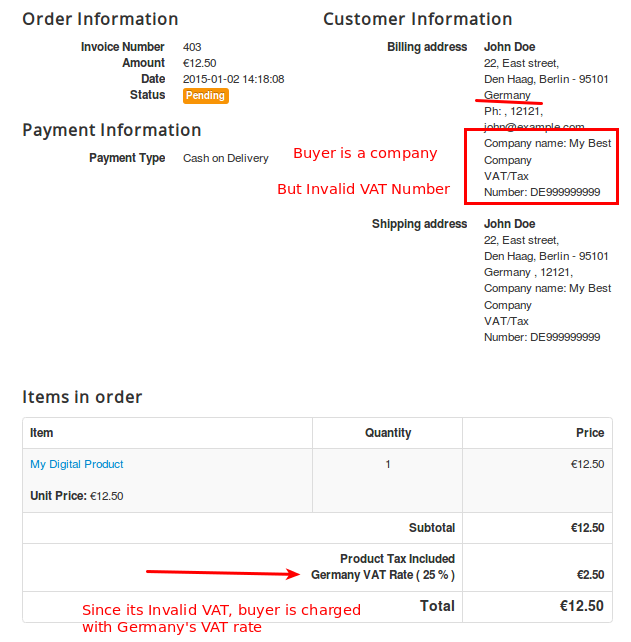
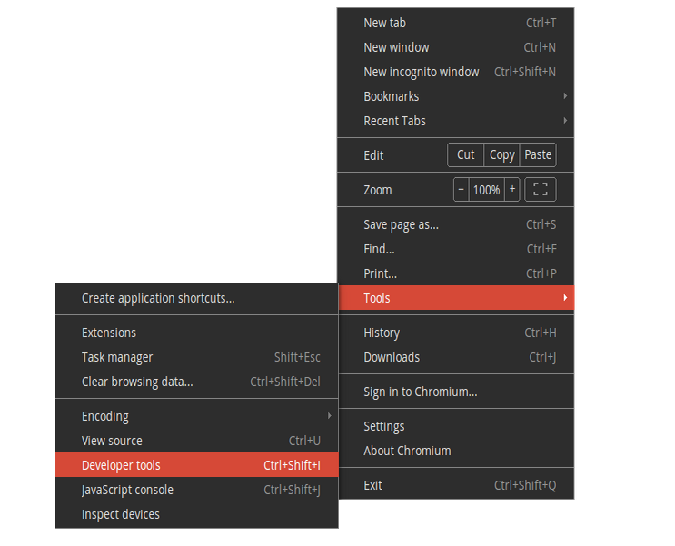
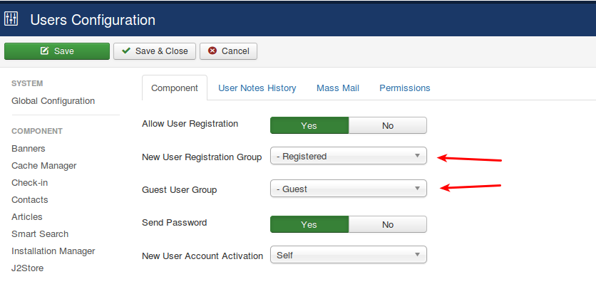
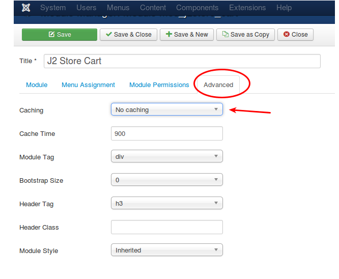

* **[Change default country in checkout](#change_default_country)**
* **[Order products in list layout](#order_products)**
* **[Troubleshooting update related issues](#update_related_issues)**
* **[Migrate from version 2.x to version 3.x](#migrate)**
* **[Options from dropdown cannot be selected](#options)**
* **[Troubleshooting USPS, FedEx, UPS and CanadaPost shipping plugins](#troubleshoot_shipping)**
* **[A simplified guide for New EU VAT rules 2015 and setting them up in J2Store](#eu_vat_rules)**
* **[solve jQuery conflict with Multi-categories component](#multicateogries)**
* **[Writing template override for the frontend order view and print layouts](#template override)**
* **[Troubleshooting Checkout issues](#checkout_issues)**
* **[How To Solve Mini Cart module related issues](#mini_Cart_issues)**
* **[HOWTO make checkout address field labels language friendly](#checkout_field_language)**

##[HOWTO] Change default country in checkout

1. Login to Joomla administrator and go to Components -> J2Store

2. Go to Set up - > Custom fields

3. Open the Country field and choose your default country. Save.

4. Open the Zone ID field and choose your default zone. Save.

5. Clear Joomla cache and check.

##[HOWTO] Order products in list layout
The product list layout by default takes the ordering in the Article Manager. However, you can change this ordering (on page load / refresh) via the Menu Parameters.

NOTE: This tutorial applies only for those using the J2Store's Product List Layout in Version 3. If you use the default article layouts, refer the Joomla documentation on ordering of articles.

Login to Joomla administration and open the menu that links your product list.

Under the Common Options tab, you can find Article Order parameter. There you can choose the ordering method.

##Troubleshooting update related issues

J2Store uses the Joomla Extension Manager for providing updates to both the free and pro users. On a few occasions, you may not be able to access the updates via the Extensions Manager. You may get a 403 access denied when you try to update in your site. It might be due to several reasons. We have listed a few that might cause this problem.

* **Download ID:**

   We provide a Download ID when you subscribe. You can find this Download ID in two places.
1.In the PDF invoice we have issued to you
2.In our website's My Downloads section. Direct link: http://j2store.org/my-downloads.html

  You should copy the Download ID and paste it in J2Store - Set up - Configuration - Update tab.

  NOTE: If you have re-set your password in our site, then a new download ID will be issued (due to security reasons and prevent unauthorized access.) 
Please make sure that the Download ID is correct.

* **Time out:**

  J2Store uses the Joomla Extension Update tool. A time out will occur if your connection is slow or if our server responds slower (which sometime occur if there are huge number of download requests)

  In this case, just try again after a few minutes. You will usually get through.
  
* **Firewall:**

  If you make repeated attempts or requests, then our firewall might block the access for a temporary period (usually 10 minutes).

  In this case, please try after 10 minutes.

  If still you get the error, you can always download the latest version from our My Downloads section: http://j2store.org/my-downloads.html and install it via the Extensions manager.
  

##[HOWTO] Migrate from version 2.x to version 3.x

With the release of Version 3, J2Store has emerged into a much more powerful e-commerce application for Joomla. Version 3 of J2Store is completely re-written from scratch using FOF Framework and follows a completely different table structure. It comes with quite a lot of new features and supports different product types.

As a result, you cannot install Version 3 directly over the version 2. It involves a migration. And don't worry!. We have simplified the migration process by developing a nice tool. We have also created a step-by-step guide that will walk you through the entire migration process.

[Click here to Download the migration tool and read the guide](http://j2store.org/support/user-guide/migrating-from-2-x-to-3-x.html)

##[HOWTO] Options from dropdown cannot be selected

This issue occurs when your site has two instances of the Jquery UI library.

**In Version 3:**

Go to Configuration - basic settings
Set the Load Jquery UI to Only Front End.
Save

**In Version 2 :**
Go to J2Store - Options - Basic settings
Set the Load Jquery UI to Only Front End.
Save.

Clear Joomla cache and refresh. Now try

##Troubleshooting USPS, FedEx, UPS and CanadaPost shipping plugins

You have installed the shipping plugin but it doesn't show up during the checkout. Here are a list of reasons that might be preventing the plugin from fetching shipping cost real-time from the APIs of the Shipping carrier.

* **Enable Shipping**

  Well. This might sound trivial. But some of us often forget to turn on the Enable shipping switch while creating the product. Make sure that Enable shipping is set to YES.
  
* **Weight and Dimensions**

  All the shipping carriers use the weight and the dimension of your product (Length, Width & Height)to calculate the shipping cost (besides using the destination address). So make sure that you enter the Weight and the dimension of your product.

 You should select the weight and the length measurement unit from the drop down list.
 
 

 **IMPORTANT for those using UPS:** Only KG (Kilogram) and LB (Pound) are supported by UPS as the weight measurement units.  Similarly, only IN (Inch) and CM (Centimetres) are supported as length measurement units. There is more. If you use Pound (LB) as the weight measurement, then the length measurement should be Inch (IN). Similar if KG is used, then CM should be the measurement.

 Also make sure that you choose the correct measurement units in the plugin settings as well. If the measurement units used in the products does not match with the settings in the plugin, then J2Store will attempt to convert the values to the measurement unit set in the plugin.

* **API credentials**

  All shipping carriers have a web service and provide credentials to access their Rate API. Some of the carriers like USPS offer TEST accounts as well. Make sure you enter these credentials correctly in the Plugin. Some of the carriers provide Customer number (like Canada Post ) and a few other parameters as well. Refer the documentation PDF that come with each plugin for more information.
  
* **Geozone**

  All the plugin come with a geozone filter setting.

  If you choose a geozone, then this shipping plugin will apply to only to customers coming from the countries/zones added under it.

  During testing, make sure that this param is set All geozones.
  
* **Debug Mode**

  In your plugin settings, set the Debug mode to YES. This will allow the plugin to log the responses sent by the APIs of the shipping carriers.

  The log is stored in the /cache folder of your Joomla Root. You can use your Hosting CPanel's file manager or an FTP program like FileZilla to access the log file. The log should give you a lot of information.
  
  

 ***VERY IMPORTANT: Debug mode SHOULD NOT be enabled in LIVE / PRODUCTION sites.***
 
Still not working, please create a private ticket or email us the log file. We will help you troubleshoot the plugin.

##A simplified guide for New EU VAT rules 2015 and setting them up in J2Store
If you are a seller of digital goods and services, you would probably wondering about the new European VAT rules that came into effect from January 1, 2015.

Since the rules are a bit of pain, we have come up with a simplified guide which will help you implement the new rules easily in your J2Store joomla shopping cart.

####The New VAT rules
In simple terms, the new VAT rules are:

– if the company sells to any countries in the EU, they will have to charge VAT in the country of the buyer instead of the seller.

– if the buyer of the digital goods is an individual, the company has to charge the VAT percentage from the country of the buyer

– if the buyer of the digital goods is a company (with a valid VAT number), there is a 0 percent VAT charge.

– if the buyer of the digital goods is a company without a VAT number or has an incorrect VAT number, then VAT of the country of the buyer must be charged.

– if the company sells digital goods to companies or individuals in their own country, local VAT needs to be charged.

####Implementing VAT rules in J2Store
**EU VAT plugin**
We have created a VAT plugin that helps you implement the VAT rules automatically.
Download and install the plugin from here:
http://j2store.org/extensions/general-plugins.html

**Implementing VAT rules in J2Store**

Let us assume that your company is located in : United Kingdom, Bristol And your home country (local ) VAT is 21 %

* ***Store Profile***
  Go to Joomla admin – J2Store – Set up – Configuration - > Store tab.

  Set the Default Country to United Kingdom Set your Default Zone to Bristol

* ***Geozone***
  Go to Joomla admin – J2Store – Localisation – Geozones – New

  Geozone Name : VAT Zone ( It can be anything. It is used just as reference ) 
  State : Published

  Add country / Zone Choose United Kingdom from the Dropdown list and add it

** IMPORTANT: According to the rule, EU residents & businesses with no valid VAT number has to be charged based on the home country's rate. **

** So it is advised that you add all the EU countries in this geozone itself. Choose EU Vat countries and add them. Refer this article to know all EU VAT countries. http://en.wikipedia.org/wiki/European_Union_value_added_tax **

(You can also add all other European countries. or create a separate geozone. But then you will have to create tax rate and map that in the tax profile. Kind of a double work!).

Save and close

* ***Tax rate***

  Go to Joomla admin – J2Store – Localisation – Tax Rates – New

  Name : VAT Rate Tax Percent : 21 Geozone : VAT Zone
  Status : Published

  Setting up the tax profile
  It is sufficient to set up ONE tax profile

  Go to Joomla admin → J2Store – Localisation → Tax profiles → New

  Tax Profile Name : My Tax Profile State : Published

  Tax Rates Mapping

  Choose VAT Rate 21 % and choose Billing Address as the Associated Address.
  Save.

* ***Applying tax profile to a product***
  J2Store uses native Joomla articles as products. So go ahead and create a product.

  Go to Joomla admin – Article Manager – New or open your digital product.

  In J2Store Tab → Item Tax , Choose My Tax Profile.

  Fill in other relevant fields for your product and save.
  
####Application of VAT rules with Examples

Now we have successfully configured the tax rules in j2store. Let us see how they will get applied for different scenarios.

**Example-1: Buyer (can be INDIVIDUAL or company) from the same country (Home Country)**

Our shop is located in United Kingdom. And the buyer is from the same country. So local tax of 21 percent applies.

**Example-2: Buyer (INDIVIDUAL) from a different EU country (Germany)**

The buyer is from Germany and he is an individual customer. So we are charging him the Germany's VAT rate of 25%.

**Example-3: Buyer (COMPANY) from a different EU country WITHOUT a valid VAT Number**

The customer is from Germany. He has entered a company name. But his VAT number is INVALID. So we apply the Germany's VAT rate of 25 %.

(the EU VAT plugin validates the VAT number provided against the EU database )

**Example 4: Buyer ( COMPANY ) from a different EU country WITH a valid VAT Number**

The customer is from Germany.  His VAT number is VALID.  So NO tax is applied.

##[HOWTO] solve jQuery conflict with Multi-categories component

If you are using the Multi-cateogies component (which adds the ability to choose more than one category for your articles), you might experience a jQuery conflict with J2Store. Here is a quick fix

Are you using Multi-categories component ?
If yes, then the issue comes due to loading of multiple Jquery UI instances.

Here is a quick fix

Open /administrator/components/com_j2store/helpers/strapper.php

Around line 33, you will find

$document->addScript(JURI::root(true).'/media/j2store/js/j2storejqui.js');

Change this to

if($mainframe->isSite()) {$document->addScript(JURI::root(true).'/media/j2store/js/j2storejqui.js');}

Save.
Logout. Clear browser cache and test.
This should fix the issue.

##Writing template override for the frontend order view and print layouts

This tutorial applies to J2store 3.x versions.

You will nedd to use your hosting CPanel file manager or an FTP client like filezilla to carry out the following tasks.

The following two files control the display of order details in frontend

##Troubleshooting Checkout issues

The checkout steps in J2Store use AJAX extensively in order to provide customers with a better online shopping experience. Customers do not have to wait for the checkout pages to refresh. The entire checkout is handled within a SINGLE PAGE and the checkout steps are loaded in an accordin style.

If your checkout steps are not working, then follow the checklist here to troubleshoot

####Javascript conflicts

Since checkout steps are loaded in real-time using Ajax, any Javascript conflict in your site might affect the process. You will see the Checkout steps not unfolding or when you press continue button, nothing will happen.

**Solution:** Installing and configuring a Javascript manager like jQuery Easy plugin will solve most of the issues. If the problem remains unsolved, follow the troubleshooting method described below.

**Troubleshooting Method:** Open your website in the Google Chrome browser. Open the browser menu and go to Tools -> Developer Tools

You can see the Developer Tools window opening at the bottom of the browser. Navigate to the Console tab.

Now Refresh your website, add a product to cart and go to checkout. The Console tab will now show you javascript conflicts, if any, in the site. It will also show you the file name and the line number that produce the error. Take a screenshot and send it to us and also send a copy to your template provider. We will check and get back to you with the solution.

####Issue with Account Registration and FreeBSD

Sometimes, customer will not be able to pass the Account Registration and Billing step. To solve this issue, please make sure that the Allow Registration is set to YES in Joomla Administration - Users - Options

If the problem continues, go to Joomla admin - system - System Information tab.

IMPORTANT NOTE: The following instruction applies only to those running PHP on a FreeBSD operating system.

Check the value for PHP Built On. It tells you the Operating system of your hosting server.  If it says, FreeBSD, then contact your host. In FreeBSD, the Filter extension is not enabled by default. Enabling it solves the problem. More information can be found [in this thread](https://forums.freebsd.org/threads/30465/)

####Checkout goes in Loop

Sometimes, customers will be redirected from the Shipping and Payment step to the first step (Loop). Or you may not be able to proceed when you click Continue at the Billing or the Shipping step.

Solution: Go to Users -> Options

Make sure the following fields are set as per the configuration given below. And then do a purchase and see if the checkout works fine.

If you still face issues, then there could be several reasons for this behavior. Please create a private ticket (Go to the support menu ) and provide super user logins. One of our developer will help you troubleshoot and solve the problem.

####Could not proceed to payment step. Stuck at the Shipping step

Make sure you are not having any old template overrides. If you are using a template like JSN One, you might be having template overrides for checkout layout.

Go to /templates/<YOUR_TEMPLATE>/html/com_j2store

Do you see a folder named: checkout

If yes, rename it as: old_checkout

Now check.

##How To Solve Mini Cart module related issues
J2Store's Mini Cart is a very handy tool for your customers when they shop. They can check the number of items in their order and the total. The cart module is refreshed in real-time using an AJax request. On a few occasions, the cart may not get updated on a real time. Here is a checklist that should help you solve the problem.

####Cache settings
Go to Joomla admin - Global configuration - System tab.

Caching is like taking a snapshot of your pages and presenting the same to every visitor coming to your site (untill the cahce is refreshed again).

Since the cart module handles dynamic data, it should be excluded from caching. In order to exclude the module from caching, your Global cache setting should be set either to Conservative Caching or Disabled. Check the screenshot below.

If you use Progressive Caching, Joomla will override the Cache settings in the module. The cart module might work fine in smarller sites with Progressive Caching enabled but if you have a larger site with a large number of visitors, then it might cause issues with the module.

####Module settings

Go to Joomla admin - Module Manager - J2Store Cart module

In the Advanced tab, set the Caching to No Cache.

####Javascript conflict

Since the J2Store updates the cart module using an AJAX request, it is important that your site does not have any javascript conflicts.

Javascript conflicts mostly occur due to loading of multiple jQuery libraries or the lack of a Javascript library. it is possible that a third party extension / module in your site might be using an older or incompatible javascript library, which might produce a conflict.

Solution A:

Please download and install a jQuery Script manager like jQuery Easy and configure it. This should solve most of the issues

Solution B:

It is not exactly a solution. Its a troubleshooting method. Open your website in the Google Chrome browser. Open the browser menu and go to Tools -> Developer Tools

You can see the Developer Tools window opening at the bottom of the browser. Navigate to the Console tab.

Now Refresh your website. The Console tab will show you if there are any javascript conflicts in your site. It will also show you the file name and the line number that produce the error. Take a screenshot and send it to us and also send a copy to your template provider. We will check and get back to you with the solution.

####JSON support

While most of the hosting service providers enable the JSON support for PHP by default, some do not. It is easy to check if JSON is enabled or not in your hosting account.

Go to Joomla admin - System - System Information - PHP Information

You can check whether JSON support enabled or not in the PHP Information tab. if you do not find any mention of JSON, then you can assume that it is not enabled for your account. You should get in touch with hosting service provider, who can enable the JSON support for your account.

You can look for something like below in the PHP Information tab.

##HOWTO make checkout address field labels language friendly

In a multi-lingual Joomla site, the checkout step doesn't convert to other language and seems to still show in english. How to make it appear in your own language ?
Simple, just rename the custom field labels as follows and it will quickly consider picking the language strings from your local language pack.

Still if you do not see the translation, please check your language pack for the following strings and translate them in your language.

language file location /administrator/language/en-GB/en-GB.com_j2store.ini